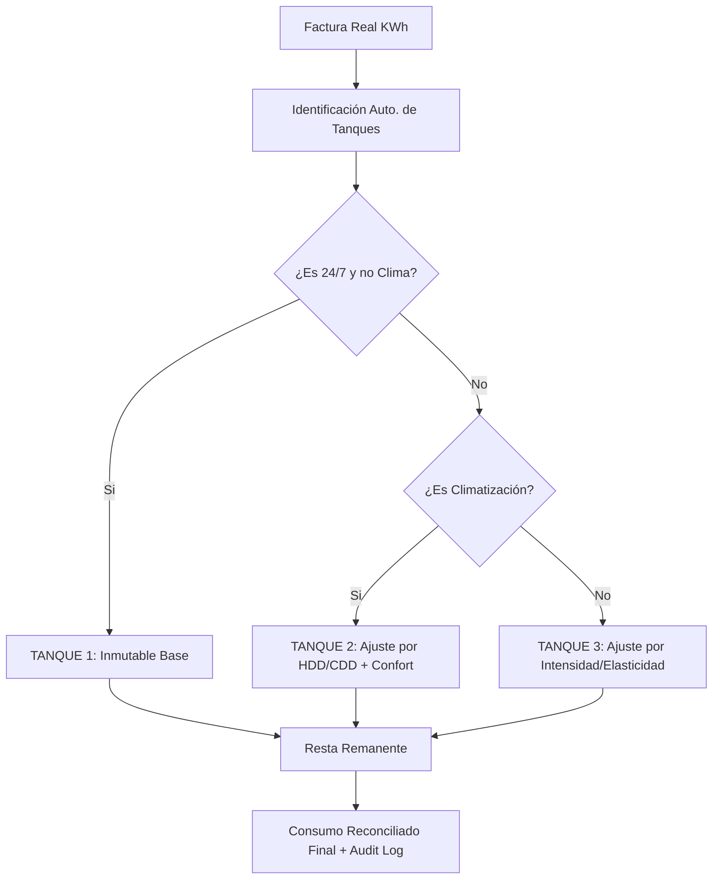

# Roadmap de Implementación: Modo Ahorro v3

Este documento detalla el plan de reestructuración del motor de cálculo de Modo Ahorro para implementar la versión 3.0 basada en una Jerarquía de Tanques y Matriz de Elasticidad.

## 1. Análisis de Situación Actual vs v3

| Característica | Estado Actual (v2.5) | Propuesta (v3.0) |
| :--- | :--- | :--- |
| **Arquitectura** | Waterfall por Tiers (Base, Pesada, Hormigas, Ballenas) | Jerarquía de 3 Tanques con **Identificación Automática** |
| **Tanque 1 (Base)**| Filtrado por nombres (Heladera, etc.) | **Automático 24/7**: (Horas=24, Diario, No Clima) |
| **Tanque 3 (Ajuste)**| Proporcional por pesos | **Matriz de Elasticidad** basada en Intensidad (Alto/Medio/Bajo) |
| **Clima** | Basado en "Días Calurosos" (>28°C) o "Fríos" (<15°C) | Basado en **Grados-Día (CDD/HDD)** con bases físicas (24°C/18°C) |
| **Perfil Hogar** | Puntuación estática básica | **Categorización A-E** que afecta directamente el multiplicador de Tanque 2 |
| **Transparencia** | Notas de calibración técnicas | **Audit Log Narrativo** |

## 2. Reestructuración de Base de Datos y Modelos

### Adaptaciones en `equipment_types`
- `process_type`: (Motor, Resistencia, Electrónico, Iluminación)
- `intensity`: (Bajo, Medio, Alto, Excesivo) - Determina la Elasticidad en el Tanque 3.
- `load_factor`: Crucial para el Tanque 1 (Heladera 0.4 vs Router 1.0).

### Adaptaciones en `equipment_usages`
- `periodicidad`: Mapeo de (diariamente, frecuentemente, etc.) a factores decimales.

### Adaptaciones en `climate_data`
- Asegurar el cálculo correcto de `cooling_degree_days` y `heating_degree_days` en base a las nuevas temperaturas de confort.

## 3. Plan de Acción (Hitos)

### Fase A: Preparación de Datos (Data layer)
1. **Migración de Metadatos**: Actualizar `equipment_types` con `intensity` y `load_factor` refinados.
2. **Seeding de Lógica**: Asegurar que los equipos 24/7 tengan el `load_factor` correcto.

### Fase B: El Nuevo Corazón (Energy Engine v3)
1. **`ClimateService`**: Cálculo de HDD/CDD exactos.
2. **`ThermalProfileService`**: Implementación del scoring A-E basado en el cuestionario de 4 pilares.
3. **`EnergyEngineService`**: Implementación de la lógica de Tanques Automática:
    - **Tanque 1 (Inmutable)**: Detecta uso 24/7 y aplica `Consumo = Potencia * 24 * Dias * load_factor`.
    - **Tanque 2 (Clima)**: Ajuste físico por HDD/CDD e impacto térmico (A-E).
    - **Tanque 3 (Ocio/Rutina)**: Distribución del remanente final por Elasticidad (Intensidad).

### Fase C: Integración y Flujos
1. **Refactorización de `ConsumptionAnalysisService`**: Integrar el nuevo motor.
2. **Sistema de Audit Log**: Generar explicaciones basadas en la nueva jerarquía.

### Fase D: UI y Visualización
1. **Dashboard de Auditoría**: Mostrar el porqué de cada ajuste al usuario.
2. **Wizard Térmico**: Formulario visual para determinar la categoría A-E.

## 4. Cambios en el Flujo de Cálculo

## 5. Próximos Pasos Inmediatos
1. Ejecutar migración para nuevos campos en `equipment_types`.
2. Implementar `EnergyEngineService.php` como clase aislada para testing.
3. Crear tests unitarios con facturas "testigo" para validar el cierre a 0 kWh.

## 6. Expansión a Entidades B2B (Oficinas/Comercios)
Para permitir que el Motor v3.0 sea utilizado en pruebas con perfiles comerciales, se deben resolver las siguientes dependencias críticas (Bloqueos de Testing):
1. **Horarios de Operación en el Modelo:** Agregar `opens_at`, `closes_at` y `operating_days` al array `$fillable` del modelo `Entity` para que el formulario de creación de `Office` los guarde correctamente y la Base de Datos preserve estos datos reales.
2. **Motor B2B No-24/7:** Refactorizar el cálculo base del `EnergyEngineService` para verificar los horarios de operación de la oficina. Romper la asunción matemática de operación constante 24/7 para que equipos base (ej. servidores, routers) calculen su consumo en kWh basados solo en el diferencial de apertura/cierre y los días laborables estipulados.
