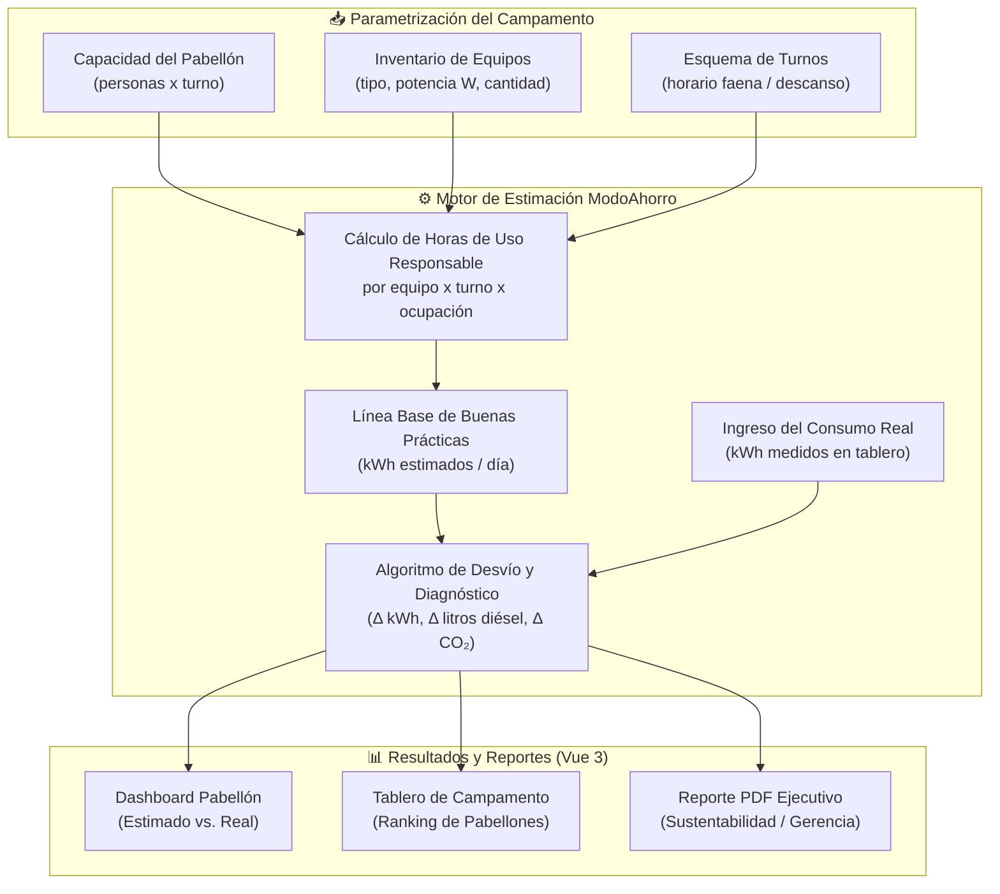

# 📋 Informe de Postulación: Hackatón Minero San Juan 2026
## *ModoAhorro Pabellones – Estimación de Consumo Responsable y Auditoría Energética en Campamentos Mineros de Alta Montaña*

---

## 🎯 1. Ficha General

| Campo | Descripción |
| :--- | :--- |
| **Nombre del Proyecto** | ModoAhorro Pabellones |
| **Subtítulo** | *Línea Base de Consumo Responsable vs. Realidad Medida en Módulos de Alojamiento Minero* |
| **Desafío Oficial** | **Desafío 3: Mapeo y vinculación de proveedores locales (CASEMI / CASETIC)** |
| **Pitch Central** | *"Tecnología 100% sanjuanina: calculamos lo que debería consumir tu pabellón y te decimos exactamente dónde se pierde la energía"* |
| **Stack** | Laravel 13 · Vue 3 · Tailwind CSS v4 · Motor de estimación propio |
| **Estado del Prototipo** | Sistema funcional con tests automatizados (59/59 ✅) |

---

## 🔴 2. El Problema: El Derroche Silencioso de los Pabellones de Montaña

### 2.1. Contexto Operativo Real (Alta Montaña +3.500 msnm)

Los campamentos mineros de la cordillera sanjuanina (Veladero, Josemaría, Los Azules, Gualcamayo) operan bajo condiciones únicas que no existen en ninguna ciudad:

* **Temperatura extrema:** Entre +10 °C en verano y -25 °C en invierno con viento blanco. **No se usan splits en modo frío.** El 100% del gasto térmico es calefacción.
* **Turnos rotativos:** Los operarios trabajan en esquemas **14x14 o 7x7**, con jornadas de **12 horas** de faena (habitualmente 07:00 a 19:00).
* **Energía cara y difícil:** No hay red pública. El kWh se genera con **grupos electrógenos diésel** abastecidos por camiones cisterna que suben a +4.000 msnm. El costo logístico del combustible es de aproximadamente **1,20 a 1,50 USD por litro puesto en cordillera**.
* **Sin facturas convencionales:** No hay boleta mensual de EPSE ni de Naturgy. El control del costo energético es responsabilidad directa de la gerencia de operaciones del campamento.

### 2.2. La Fricción y el Dolor Real

> **Escenario tipo:** El operario sale a las 06:30 hs hacia la faena y deja su convector de pared a 28 °C. Regresa a las 19:30 hs después de 13 horas.
>
> **El pabellón queda vacío durante 12 horas con las 20 estufas encendidas al máximo.**

Calculado en números concretos por pabellón:

| Concepto | Dato |
| :--- | :--- |
| Convectores eléctricos por pabellón | 20 unidades x 1.500 W |
| Potencia total instalada | 30 kW |
| Horas de derroche (pabellón vacío) | ~12 hs/día |
| **Energía desperdiciada por día** | **~360 kWh/día** |
| Litros de diésel equivalentes a 360 kWh | **~103 litros/día** (factor 0,28 L/kWh diésel) |
| **Costo económico diario (a 1,35 USD/L)** | **~139 USD/día solo en ese pabellón** |
| En un campamento con 10 pabellones | **~1.390 USD/día derrochados** |

Ese es el problema que **nadie mide y nadie ve** porque no existe una herramienta que calcule cuánto *debería* consumir el pabellón vs. cuánto *realmente* consumió.

---

## 💡 3. La Solución: Estimación de Línea Base de Buenas Prácticas

### 3.1. Concepto Central

**ModoAhorro Pabellones** es una plataforma web que le permite a la minera realizar **tres acciones clave:**

```
1. PARAMETRIZAR  →  2. ESTIMAR  →  3. COMPARAR y DIAGNOSTICAR
```

1. **Parametrizar el Pabellón:**
   * Capacidad de ocupación (ej: 40 personas).
   * Horario de turno / faena (ej: 07:00 – 19:00 con pabellón desocupado).
   * Inventario de equipos: tipo, potencia (W) y horas de uso responsable recomendadas.

2. **Estimar la Línea Base de Consumo Responsable:**
   * El motor de ModoAhorro calcula el consumo **teórico bajo buenas prácticas**:
     * Durante turno de faena: calefacción en modo ECO / mantenimiento (ej: 40% de potencia para mantener +5 °C y evitar congelamiento de cañerías, pero no 28 °C con nadie adentro).
     * En hora de cambio de turno (06:00 – 07:30 y 19:00 – 20:30): funcionamiento pleno para duchas, preparación y descanso.
   * **Resultado:** *"Este pabellón, con 40 personas y buenas prácticas, debería consumir **280 kWh/día**."*

3. **Comparar contra el Consumo Real:**
   * El supervisor de campamento ingresa el consumo real medido en el tablero del pabellón (quincenal o mensual).
   * **El diagnóstico automático de ModoAhorro:**

```
Consumo Estimado (Buenas Prácticas):  280 kWh/día
Consumo Real Registrado:              580 kWh/día
──────────────────────────────────────────────────
Desvío:                              +300 kWh/día  (+107%)
Equivalente en diésel:               ~84 litros/día de más
Equivalente en CO₂:                  ~222 kg CO₂/día de más
Costo económico del desvío:          ~$114 USD/día en ese pabellón
```

   * **Diagnóstico cualitativo automático:** *"El desvío detectado es consistente con calefacción activa durante horario de desocupación. Se recomienda: instalar control horario automatizado o protocolo de apagado parcial al inicio del turno de faena."*

### 3.2. Las Tres Salidas de Valor: Lo que hace el Software con el Desvío

Una vez detectado el desvío entre la Línea Base de Buenas Prácticas y el consumo real, el sistema genera **tres salidas de valor concretas** orientadas 100% al comportamiento humano (no a procesos industriales que el software no puede controlar):

#### 📚 Salida 1: Capacitación de Recursos Humanos
* **¿Qué es?** El desvío detectado se convierte en **evidencia documentada y objetiva** para que el área de RRHH o el supervisor de turno use en charlas de inducción, entrenamiento y concientización energética.
* **¿Cómo se usa?** El sistema genera un reporte por pabellón que muestra, de forma clara y sin culpar a nadie individualmente, *cuándo* ocurre el desvío (horario de faena = pabellón vacío con calefacción al máximo) y *cuánto* cuesta ese hábito en pesos y en litros de diésel.
* **Ejemplo:** *"En la charla de seguridad del lunes, el supervisor muestra que el Pabellón B-02 desvió 300 kWh la semana pasada, equivalente a 84 litros de combustible. Eso es lo que costó no apagar o bajar la estufa al salir a la faena."*

#### ⚠️ Salida 2: Registro de Penalizaciones y Desvíos Reiterativos
* **¿Qué es?** Si un pabellón supera la línea base de forma reiterada (ej: 3 quincenas consecutivas con más del 50% de desvío), el sistema genera una **alerta formal y un registro histórico auditable** que la gerencia puede usar para aplicar protocolos disciplinarios o de revisión de procedimientos.
* **¿Cómo se usa?** La gerencia de operaciones ve el historial de desvíos por pabellón. Si el desvío es estructural (no puntual), queda documentado para justificar inversiones en automatización (ej: termostatos programables, control horario) o para aplicar las políticas internas del campamento.
* **Lo que NO hace:** No señala a ningún operario individualmente. Registra el comportamiento del pabellón como unidad colectiva.

#### 🌿 Salida 3: "Onda Verde" – Reconocimiento de Buenas Prácticas
* **¿Qué es?** Los pabellones que cumplen o están por debajo de la Línea Base de Buenas Prácticas reciben un **badge digital o certificación de eficiencia** visible en el tablero del campamento.
* **¿Para qué sirve?**
  * **Para los operarios:** Gamificación positiva. El pabellón "más verde" del mes es reconocido públicamente. Genera orgullo de equipo y competencia sana entre pabellones.
  * **Para la minera:** El reporte de "Onda Verde" es parte del **informe ESG (Environmental, Social & Governance)** que las operadoras presentan ante el Ministerio de Minería de San Juan, inversores internacionales y comunidades aledañas.
  * **Para el Hackatón:** Es el elemento de innovación social más potente de la propuesta. No sólo mide y penaliza: **premia y motiva**.

#### 🔧 Salida 4: Recomendación de Reemplazo por Equipos Más Eficientes
* **¿Qué es?** Cuando el desvío es **estructural y persistente** (el pabellón sigue desviando aunque se haya capacitado y advertido al personal), el sistema detecta que el problema ya no es de hábito sino de **tecnología obsoleta o sobredimensionada** e incorpora una recomendación automática de sustitución de equipos.
* **¿Cómo funciona?**
  * Si un convector de resistencia eléctrica de 1.500 W consume en modo base más de lo esperado incluso en horario de desocupación mínima, el sistema sugiere su reemplazo por un **panel radiante de bajo consumo con termostato programable** o un **calefactor por infrarrojos de onda larga** (más eficiente en espacios de alta montaña con ventilación frecuente por apertura de puertas).
  * Si el termotanque individual de 3.000 W arroja desvíos sostenidos, el sistema puede recomendar la migración a un **sistema centralizado de agua caliente sanitaria** con caldera eficiente y distribución por tuberías con traceado inteligente.

> 🌞 **Nota Técnica: Calefones Solares de Tubos de Vacío en Alta Montaña**
>
> La recomendación estrella de sustitución del termotanque eléctrico en campamentos de alta montaña es el **colector solar de tubos de vacío**, y es 100% factible en la cordillera sanjuanina por la siguiente razón física clave:
>
> **La irradiancia solar NO depende de la temperatura ambiente.** A +4.000 msnm hay menos atmósfera filtrando los rayos UV e infrarrojos, lo que resulta en una irradiancia de **6 a 8 kWh/m²/día** (comparable al desierto de Atacama y entre las más altas del planeta). Se puede estar a -20 °C y quemarse la piel porque el sol calienta a máxima potencia.
>
> | Tecnología | Clima de Alta Montaña | ¿Por qué? |
> | :--- | :---: | :--- |
> | Placa plana convencional | ❌ No viable | Se congela de noche, rompe cañerías |
> | **Tubos de vacío (evacuated tubes)** | ✅ Viable | El vacío aísla el fluido del frío exterior. Opera de -40 °C a +200 °C |
>
> El vacío interior actúa como un termos perfecto: la temperatura exterior de -20 °C no le llega al fluido caloportador, pero la radiación solar sí penetra el vidrio y lo calienta igual. El sistema almacena el agua caliente en un termotanque acumulador muy bien aislado y solo usa respaldo eléctrico en días de tormenta o alta nubosidad.
>
> **Casos reales en minería andina:** Mina Escondida (BHP, Chile, 3.100 msnm), proyectos de litio en la Puna argentina y evaluaciones en Pascua Lama (4.500 msnm) han implementado o evaluado estos sistemas con éxito.
>
> **En el sistema ModoAhorro Pabellones:** Cuando el termotanque eléctrico de un pabellón acumula desvíos estructurales, la Salida 4 genera automáticamente una recomendación de sustitución por tubos de vacío con el ROI calculado:
> *"Ahorro estimado: 80% del consumo eléctrico de ACS. Inversión estimada: USD 3.200 por pabellón. ROI: 5 a 7 meses según precio del combustible en cordillera."*


* **¿Qué genera el sistema?** Un **informe de retorno de inversión (ROI)** estimado: cuánto costaría reemplazar el equipo vs. cuánto se ahorra en diésel en 6 o 12 meses. Eso le da a la gerencia un argumento económico concreto para aprobar la inversión en capital.
* **Ejemplo:**
  > *"El Pabellón A-01 lleva 4 quincenas con desvío superior al 60% pese a las campañas de concientización. El sistema estima que reemplazar los 20 convectores actuales por paneles de bajo consumo con termostato requiere una inversión de USD 4.800 y genera un ahorro de USD 1.200/mes en combustible. El ROI se alcanza en 4 meses."*

> **Ciclo completo de mejora continua:**
> ```
> DESVÍO DETECTADO  →  📚 Capacitación   (cambio de hábito)
>                   →  ⚠️  Penalización   (registro auditable de reiteración)
>                   →  🌿 Onda Verde      (badge de cumplimiento y reconocimiento)
>                   →  🔧 Reemplazo       (ROI de sustitución por equipo más eficiente)
> ```

---

### 3.3. Escalabilidad a Nivel de Campamento


El sistema agrega el diagnóstico de todos los pabellones del campamento en un **tablero ejecutivo** (scroll-free, diseño industrial oscuro) que le muestra al Gerente de Sustentabilidad / Gerente de Operaciones:

* Ranking de pabellones: de mayor a menor desvío energético.
* Ahorro potencial total del campamento expresado en litros de diésel y en dólares.
* Evolución quincenal / mensual del comportamiento de consumo vs. la línea base.
* Exportación en PDF para reporte de sustentabilidad y cumplimiento ambiental ante el Ministerio de Minería de San Juan.

---

## 🏗️ 4. Arquitectura Técnica: ¿Cómo lo resuelve el Motor de ModoAhorro?

El motor de estimación de ModoAhorro **ya implementa la lógica base** que hace posible esto sin construir desde cero:



### 4.1. Mapeo de Entidades: De ModoAhorro Residencial a Pabellones Mineros

| Entidad en ModoAhorro actual | Equivalente en ModoAhorro Pabellones |
| :--- | :--- |
| `Entity` (Entidad / Propiedad) | Campamento Minero (ej: *Campamento Amarillos – Veladero*) |
| `Room` (Espacio / Ambiente) | Pabellón de Alojamiento (ej: *Pabellón B-02 – 40 personas*) |
| `Equipment` (Equipo eléctrico) | Convector de pared, Termotanque, Iluminación LED |
| `Invoice` (Factura) | Lectura de tablero del pabellón (kWh/quincena) |
| Motor de cálculo de consumo | Motor de Línea Base de Buenas Prácticas de Alta Montaña |

### 4.2. Catálogo de Equipos de Alta Montaña (Sin Aires Acondicionados)

Los equipos relevantes para la cordillera sanjuanina son radicalmente distintos al perfil urbano o residencial:

| Equipo | Potencia típica | Contexto de uso |
| :--- | :---: | :--- |
| **Convector eléctrico de pared** | 1.500 W | Calefacción de habitaciones individuales |
| **Panel radiante de techo** | 1.000 W | Áreas comunes y corredores de pabellones |
| **Calentador de agua (termotanque)** | 3.000 W | ACS para duchas en cambio de turno |
| **Traceado eléctrico anticongelamiento** | 20-30 W/m | Cañerías exteriores 24/7 en invierno |
| **Iluminación LED de pasillo** | 40 W/tramo | Permanente nocturna + emergencias |
| **Frigobares de módulo de guardia** | 100 W | Almacenamiento de medicamentos / guardia médica |

---

## 📊 5. Alineación con la Rúbrica de Evaluación (100 Puntos)

| Criterio Oficial | Ptos | Cómo lo resuelve ModoAhorro Pabellones |
| :--- | :---: | :--- |
| **Comprensión del Problema** | **20** | Fricción documentada y cuantificada: costo real del kWh en alta montaña (~1,35 USD/litro de diésel), turnos rotativos 14x14, derroche térmico en habitaciones vacías durante la faena. No es una suposición genérica, es el cotidiano del campamento cordillerano. |
| **Impacto** | **20** | Métrica concreta: ~100 litros de diésel ahorrados por día, por pabellón, cuando se usa el modo ECO durante faena. En un campamento de 10 pabellones: ~365.000 litros/año de ahorro potencial (~493.000 USD/año). |
| **Viabilidad** | **20** | 100% software web: sin hardware riesgoso, sin permisos de exploración. El supervisor de campamento lo opera desde el navegador. Adaptación sobre base de código funcional y testeado. |
| **Calidad e Innovación** | **15** | No es un directorio estático ni un Excel más. Es la primera plataforma que aplica estimación de línea base de buenas prácticas adaptada a la realidad térmica y operativa de la alta montaña sanjuanina. |
| **Prototipo** | **10** | Sistema web completamente funcional. Demo en vivo: carga de pabellón, ejecución del motor de estimación, comparación con consumo real y exportación de reporte. 59/59 tests automatizados en verde. |
| **Datos, Seguridad y Uso Responsable de IA** | **10** | Datos propios y anonimizados (no requiere conexión a sistemas industriales SCADA). Motor de estimación basado en criterios de ingeniería transparentes y auditables. Sin caja negra: cada resultado muestra el cálculo paso a paso. Seguridad Laravel (CSRF, XSS, validaciones estrictas). |
| **Presentación y Equipo** | **5** | Pitch claro, con historia real, números concretos y demostración en vivo. Equipo de desarrollo local sanjuanino. |
| **TOTAL** | **100** | |

---

## 🚩 6. Argumento Estratégico: Compre Tecnológico Local

> *"Las grandes operadoras mineras suelen contratar consultoras de sustentabilidad y software de gestión energética de Buenos Aires, Santiago de Chile o el exterior.*
>
> *ModoAhorro Pabellones es la demostración viva de que en San Juan ya existe el talento tecnológico para resolver los problemas de eficiencia de la propia industria minera.*
>
> *No hace falta ir a buscar a otro puerto lo que ya desarrollamos acá."*

Esto es exactamente lo que CASEMIC, CASETIC y el Gobierno de San Juan quieren evidenciar ante la industria: que la **economía del conocimiento sanjuanina** puede proveerle servicios de alto valor a la minería sin depender del exterior.

---

## 📋 7. Próximos Pasos

### Para la Postulación (antes del 9 de Octubre):
- [ ] Inscripción en [ciclopilares.com.ar](https://ciclopilares.com.ar) usando este informe como base.
- [ ] Título tentativo: *"ModoAhorro Pabellones: Estimación de Consumo Responsable y Auditoría Energética en Campamentos Mineros"*.

### Para el Sprint de Desarrollo (19 Oct – 8 Nov):
- [ ] Revisar y refactorizar el motor de estimación para incorporar el esquema de turnos/faena y el catálogo de equipos de alta montaña.
- [ ] Crear seeder de "Campamento Tipo Cordillera Sanjuanina" con pabellones, dotación y equipos reales.
- [ ] Diseñar el tablero de diagnóstico con la comparación Estimado vs. Real y ranking de desvíos por pabellón.
- [ ] Preparar el video pitch y el PDF de 5 carillas para la entrega del 9 de Noviembre.
