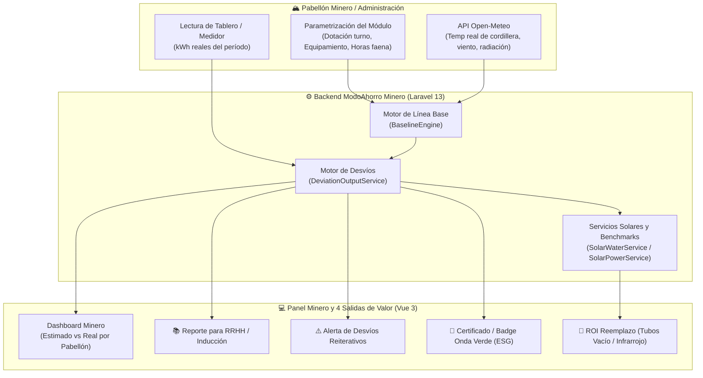

# 🏔️ Plan Estratégico y Técnico: Hackatón Minero San Juan 2026
## *Proyecto: ModoAhorro Pabellones – Estimación de Consumo Responsable y Auditoría Energética en Campamentos Mineros*

---

## 📌 1. Visión General del Proyecto

### 1.1. La Problemática en Campamentos Mineros
En los proyectos mineros cordilleranos (Veladero, Josemaría, Los Azules, Gualcamayo, etc.):
* **Aislamiento de red:** No existe red pública convencional ni "facturas mensuales de luz". Los campamentos operan con *microgrids* (generación diésel, parques solares aislados o líneas privadas de alta tensión).
* **Costo por kWh exorbitante:** El kWh no se paga con boleta; se paga con litros de gasoil subidos a +4.000 msnm en camiones cisterna, mantenimiento de generadores y toneladas de CO₂ emitidas (~1.35 USD/litro puesto en cordillera).
* **Derroche por hábitos humanos en módulos desocupados:** Calefacción y termotanques eléctricos quedan encendidos al máximo en dormitorios y pabellones vacíos durante los turnos de faena de 12 horas.
* **Falta de visibilidad de lo que "debería" consumirse:** La minera ve el consumo total o la lectura del medidor/tablero del pabellón, pero no tiene una herramienta que calcule si ese número es razonable o representa un derroche evitable.

### 1.2. La Propuesta de Valor
> **ModoAhorro Pabellones** no busca monitorear procesos industriales incontrolables (molinos, palas, ventilación de piques), sino el **consumo de los pabellones de alojamiento y módulos administrativos**, donde el factor determinante es el **comportamiento humano**:
>
> 1. **Cargar:** Datos del pabellón (equipos térmicos, dotación del turno, horarios de faena/descanso).
> 2. **Estimar (Línea Base):** Calcular cuánto *debería consumir* con buenas prácticas en alta montaña.
> 3. **Comparar:** Contrastar contra la *lectura real del tablero/medidor* del pabellón.
> 4. **Diagnosticar y Accionar:** Disparar 4 salidas de alto valor: **📚 Capacitación (RRHH)**, **⚠️ Registro de Penalización**, **🌿 Reconocimiento Onda Verde (ESG)** y **🔧 Recomendación de Reemplazo Tecnológico (ROI)**.

---

## 🎯 2. Encuadre Estratégico en los Desafíos del Concurso

| Desafío Oficial | Cómo encaja el Proyecto | Diferencial Competitivo |
| :--- | :--- | :--- |
| **Desafío 3: Mapeo y vinculación de proveedores locales (CASEMI / CASETIC)** | Proveedor de software y tecnología 100% sanjuanina. Demuestra que no hace falta contratar consultoras foráneas en dólares para auditar y eficientizar la huella energética de los campamentos mineros locales. | Software real, probado, con 59 tests automatizados en verde y escalable. |
| **Desafío 5: Telemetría, Eficiencia Operativa y Gestión de Recursos** | Ingesta de lecturas de tableros eléctricos y medidores de pabellón con cálculo algorítmico de desvío térmico y puente hacia futuros gemelos digitales. | Trazabilidad exacta de kWh derrochados convertidos a litros de diésel y $ USD. |

---

## 🏗️ 3. Adaptación Arquitectónica (De ModoAhorro Residencial a Minero)



### 3.1. Tratamiento del Módulo de Facturas
* **No hay boleta convencional:** El modelo interno `Invoice` se utiliza como **Lectura de Tablero / Registro de Consumo** de cada pabellón.
* Campos extendidos: `source_type` (generador, red, solar), `shift_code` (turnos A/B/C/D), `occupancy_count` (dotación real), `demand_kw_peak`.

### 3.2. Mapeo y Escalabilidad de Entidades
* **Entidades:** 
  * `pabellon` (nuevo): Pabellones de alojamiento (habitaciones, baños, comedores).
  * `oficina` (existente): Se mantiene intacto para salas de control, módulos administrativos y enfermería.
  * `hogar` y `comercio`: Se preservan sin alteración para mantener la plataforma base.
* **Equipos de Alta Montaña:** Convectores de pared, traceado anticongelamiento, paneles radiantes, termotanques industriales, racks IT.

---

## 🚀 4. Plan de Ejecución por Sprints

```mermaid
gantt
    title Cronograma Hackatón Minero 2026
    dateFormat  YYYY-MM-DD
    section Registro & Postulación
    Inscripción en ciclopilares.com.ar      :done, 2026-09-22, 2026-10-09
    Anuncio de Equipos Seleccionados        :2026-10-16, 2026-10-16
    section Desarrollo (3 semanas)
    Sprint 1: Modelo Pabellón & Catálogo    :2026-10-19, 2026-10-25
    Sprint 2: BaselineEngine & 4 Salidas    :2026-10-26, 2026-11-01
    Sprint 3: UI Dashboard & Seeder Demo    :2026-11-02, 2026-11-07
    section Entrega & Final
    Entrega Final (Video, PDF, Prototipo)   :crit, 2026-11-09, 2026-11-09
    Evaluación Técnica                      :2026-11-10, 2026-11-13
    Pitch Presencial en CECI                :crit, 2026-11-18, 2026-11-18
    Premiación FNS FORUM                    :2026-11-19, 2026-11-19
```

### 🗓️ Sprint 1 (Oct 19 - Oct 25): Modelo Pabellón, Catálogo Minero y Migraciones
- [ ] Incorporar tipo `pabellon` en `config/entity_types.php` y crear `MiningCampProfile.php`.
- [ ] Sembrar categorías y tipos de equipos mineros de alta montaña (convectores, traceado, termotanques).
- [ ] Agregar migraciones para `source_type`, `shift_code`, `occupancy_count` en `invoices` y campos de campamento en `entities`.

### 🗓️ Sprint 2 (Oct 26 - Nov 01): Motor de Línea Base, Desvíos y Benchmarks de Reemplazo
- [ ] Implementar `BaselineEngine` (cálculo de consumo responsable según turnos y ocupación).
- [ ] Implementar `DeviationOutputService` con generación de las 4 salidas: Capacitación, Penalización, Onda Verde y Reemplazo.
- [ ] Adaptar `SolarWaterService` y `SolarPowerService` con variables de Puna andina y equivalencias diésel.
- [ ] Cargar benchmarks de sustitución tecnológica (termotanques vs calefones solares de tubos de vacío, convectores vs infrarrojos).

### 🗓️ Sprint 3 (Nov 02 - Nov 07): Dashboard Minero y Demo Navegable
- [ ] Diseñar vista `resources/js/Pages/Mining/Dashboard.vue` con estética oscura industrial y widgets de desvío.
- [ ] Adecuar textos y labels para entorno minero ("Lectura de Tablero", "Costo Asignado").
- [ ] Crear seeder completo "Campamento Veladero Demo" con pabellones en diferentes estados de desvío para el pitch.

### 🗓️ Sprint 4 (Nov 08 - Nov 09): Entregables Oficiales
- [ ] Redacción final del documento de 5 carillas.
- [ ] Grabación de video pitch de 5 minutos con demo en vivo del software corriendo.
- [ ] Formulario de declaración de APIs (Open-Meteo) y arquitectura de software.

---

## 💡 5. Argumento Ganador para el Jurado

1. **Software Real y Probado:** No es una maqueta ni un Excel. Es una plataforma fullstack en Laravel 13 y Vue 3 con 59 tests automatizados pasando en verde.
2. **Foco en el Comportamiento Humano:** No promete controlar complejas maquinarias de molienda de forma irreal; ataca el derroche térmico evitable en pabellones donde descansan los operarios.
3. **Propiedad Intelectual y Soberanía Tecnológica:** Cumple al 100% el espíritu del Compre Local (CASEMI / CASETIC), probando que San Juan cuenta con la capacidad de crear herramientas de eficiencia energética para su propia minería.

---

## 📋 6. Próximo Paso Inmediato
* **Registrar el equipo en [ciclopilares.com.ar](https://ciclopilares.com.ar)** antes del **9 de octubre** con el título:
  > *"ModoAhorro Pabellones: Estimación de Consumo Responsable y Auditoría Energética en Campamentos Mineros"*.
