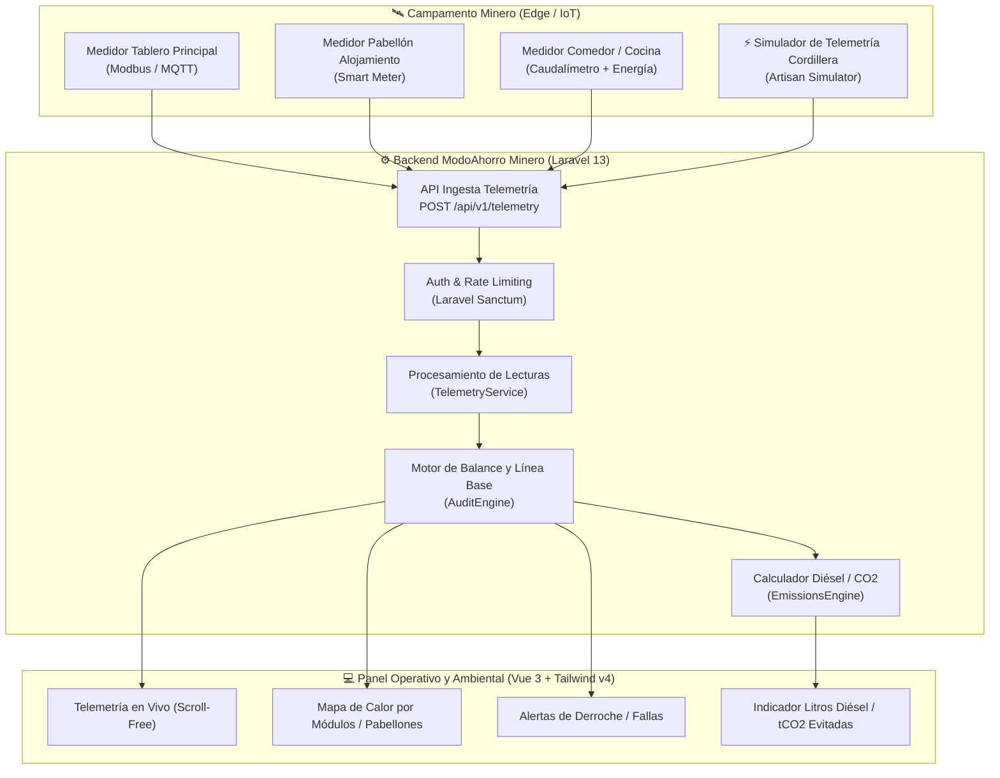

# 🏔️ Plan Estratégico y Técnico: Hackatón Minero San Juan 2026
## *Proyecto: Smart Mining Camp – Telemetría y Eficiencia de Recursos en Campamentos Remotos*

---

## 📌 1. Visión General del Proyecto

### 1.1. La Problemática en Campamentos Mineros
En los proyectos mineros cordilleranos (Veladero, Josemaría, Los Azules, Gualcamayo, etc.):
* **Aislamiento de red:** No existe red pública convencional ni "facturas mensuales de luz". Los campamentos operan con *microgrids* (generación diésel, parques solares aislados o líneas privadas de alta tensión).
* **Costo por kWh exorbitante:** El kWh no se paga con boleta; se paga con litros de gasoil subidos a +4.000 msnm en camiones cisterna, mantenimiento de generadores y toneladas de CO₂ emitidas.
* **Derroche en módulos ociosos:** Calefacción, climatización y termotanques eléctricos quedan encendidos en módulos de alojamiento vacíos durante los turnos de faena o cambios de guardia.
* **Falta de visibilidad de recursos:** El campamento consume miles de litros de agua potable y energía sin una segregación por módulos (pabellones, comedores, talleres, laboratorios).

### 1.2. La Propuesta de Valor
Transformar el motor de cálculo y auditoría de **ModoAhorro** en una plataforma industrial B2B:
> **Eliminar la dependencia de facturas manuales** y reemplazarla por la **ingesta continua de telemetría desde medidores inteligentes (Smart Meters / IoT)**, monitoreando consumo de energía (kWh) y agua (m³), detectando anomalías en tiempo real y cuantificando el ahorro directo en **litros de diésel y huella de carbono (tCO₂e)**.

---

## 🎯 2. Encuadre Estratégico en los Desafíos del Concurso

| Desafío Oficial | Cómo encaja el Proyecto | Diferencial Competitivo |
| :--- | :--- | :--- |
| **Desafío 1: Monitoreo hídrico participativo y transparencia** | Telemetría en tiempo real del uso de agua y energía en campamentos de operarios. Balance hídrico transparente y auditable para operadoras y comunidades. | Trazabilidad exacta de cuánta agua consume el campamento vs. faena minera. |
| **Desafío 5: Telemetría y asistencia segura / Eficiencia operativa** | Ingesta de sensores industriales de subestaciones y tableros de campamento con alertas tempranas de sobrecarga y consumos anómalos. | Detección automatizada de anomalías sin intervención humana. |

---

## 🏗️ 3. Adaptación Arquitectónica (De ModoAhorro Residencial a Minero)



### 3.1. Reemplazo del Módulo de Facturas
* **Antes:** `Invoice` (Carga manual de PDF/factura, total en $, consumo bimestral).
* **Ahora:** 
  * `Meter`: Dispositivo físico/lógico asignado a un Módulo/Room (ej: ID `SM-PABELLON-B`, tipo: Eléctrico / Hídrico).
  * `MeterReading`: Serie temporal (`meter_id`, `timestamp`, `active_energy_kwh`, `peak_power_kw`, `water_volume_m3`, `status`).
  * `DailyBalance`: Agregación automática por día/turno sin necesidad de facturación externa.

### 3.2. Mapeo de Entidades
* **Entity:** Campamento (ej: *Campamento Base Veladero - Capacidad 1.500 personas*).
* **Rooms (Módulos):**
  * *Alojamiento:* Pabellones A1, A2, B1, etc.
  * *Servicios:* Cocina Industrial, Comedor, Lavandería.
  * *Infraestructura:* Planta de Tratamiento de Efluentes, Potabilizadora, Sala de Compresores.
* **Equipos:** Climatización HVAC industrial, Termotanques solares/eléctricos de alta capacidad, Iluminación perimetral LED, Bombas elevadoras.

### 3.3. Nuevas Métricas Industriales
* **Costo Energético Evitado:** En base al costo logístico del litro de diésel puesto en cordillera (~1.20 a 1.50 USD/L).
* **Huella de Carbono:** Factor de emisión $0.27 \text{ kg CO}_2/\text{kWh}$ (diésel estándar) o curva híbrida.
* **Consumo Per Cápita:** $\text{kWh/persona/día}$ y $\text{L/persona/día}$ ajustado por la dotación activa de personal en el turno.

---

## 🚀 4. Plan de Ejecución por Sprints (Cronograma del Hackatón)

```mermaid
gantt
    title Cronograma Hackatón Minero 2026
    dateFormat  YYYY-MM-DD
    section Registro & Postulación
    Inscripción en ciclopilares.com.ar      :done, 2026-09-22, 2026-10-09
    Anuncio de Equipos Seleccionados        :2026-10-16, 2026-10-16
    section Desarrollo (3 semanas)
    Sprint 1: Modelado & API Telemetría     :2026-10-19, 2026-10-25
    Sprint 2: Motor de Desvío & Simulador   :2026-10-26, 2026-11-01
    Sprint 3: UI Campamento & KPI Diésel/CO2:2026-11-02, 2026-11-07
    section Entrega & Final
    Entrega Final (Video, PDF, Prototipo)   :crit, 2026-11-09, 2026-11-09
    Evaluación Técnica                      :2026-11-10, 2026-11-13
    Pitch Presencial en CECI                :crit, 2026-11-18, 2026-11-18
    Premiación FNS FORUM                    :2026-11-19, 2026-11-19
```

### 🗓️ Sprint 1 (Oct 19 - Oct 25): Modelo de Telemetría e Ingesta
- [ ] Crear migración y modelos: `Meter`, `MeterReading`, `CampShift` (turnos/dotación).
- [ ] Desacoplar la obligación de `Invoice` en el flujo de auditoría.
- [ ] Implementar endpoint de alta performance: `POST /api/v1/telemetry/push` con validación estricta y autenticación por API Token de dispositivo.
- [ ] Tests de integración para la ingesta de telemetría (Pest/PHPUnit).

### 🗓️ Sprint 2 (Oct 26 - Nov 01): Motor de Auditoría en Tiempo Real y Simulador
- [ ] **Simulador de Campamento Cordillerano:** Comando `php artisan camp:simulate-telemetry` que reproduce 30 días de lecturas realistas de un campamento de 800 operarios (turnos 14x14, picos de comedor 06:00-08:00 y 19:00-21:00, bajadas nocturnas, y 3 anomalías intencionales de derroche térmico).
- [ ] Algoritmo de detección de derroche por módulo: Comparación de potencia activa vs. dotación real del módulo.
- [ ] Cálculo de equivalencias ambientales: Litros de diésel ahorrados y reducción de emisiones CO₂.

### 🗓️ Sprint 3 (Nov 02 - Nov 07): Dashboard Especializado y Reportes
- [ ] Vista Vue 3 adaptada a la identidad minera (modo oscuro industrial, KPIs de alto impacto visual, vista sin scroll).
- [ ] Componente gráfico interactivo de distribución de cargas por módulo del campamento.
- [ ] Widget de alerta temprana: *"Pabellón C-2 consumiendo 18 kW con dotación 0 (Posible falla de climatización)"*.
- [ ] Exportación de reporte ejecutivo en PDF para gerencia de sustentabilidad/operaciones.

### 🗓️ Sprint 4 (Nov 08 - Nov 09): Preparación de Entregables Oficiales
- [ ] **Documento PDF de 5 carillas:**
  1. Problema y Solución (Dolor del costo energético en campamentos remotos).
  2. Arquitectura de Hardware/Software (Simulador + API + Motor).
  3. Impacto Económico y Ambiental (Ahorro de $ y tCO₂e).
  4. Modelo de Escalabilidad e Integración (Modbus/SCADA industrial).
  5. Perfil del Equipo y Viabilidad.
- [ ] **Video Pitch de 5 minutos:** Grabación de pantalla con demo en vivo del simulador + dashboard reactivo.
- [ ] Declaración de librerías, APIs e IA según el reglamento del concurso.

---

## 💡 5. Argumento Ganador para el Jurado

1. **No es un PowerPoint, es software real y testeado:** La gran mayoría de los equipos presentará maquetas en Figma o scripts sueltos. Nuestro proyecto se apoya en un sistema con arquitectura robusta en Laravel 13, suite de tests verdes y frontend reactivo en Vue 3.
2. **Propiedad Intelectual 100% propia:** Las bases garantizan que el código queda en nuestras manos (Punto 19). Lo desarrollado para el hackatón pasa a ser un producto SaaS vendible a cualquier empresa minera o contratista de campamentos (ej. Cookins, Aramark, Techint, operadoras directas).
3. **Impacto económico inmediato:** Demostrar que detectar un 10% de derroche en calefacción/climatización en un campamento de 1.000 personas ahorra **decenas de miles de litros de combustible al mes**, pagando la plataforma en semanas.

---

## 📋 6. Próximo Paso Inmediato
* **Registrar el equipo en [ciclopilares.com.ar](https://ciclopilares.com.ar)** antes del **9 de octubre** con el título tentativo:
  > *"Smart Mining Camp: Plataforma de telemetría y eficiencia energética-hídrica para campamentos mineros aislados"*.
