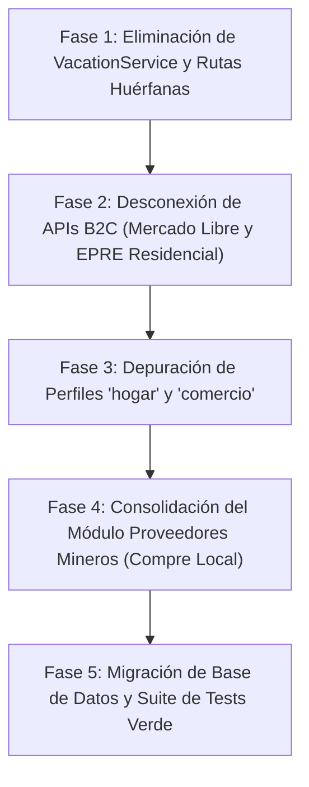

# Plan de Reestructuración e Implementación: ModoAhorro Minería

**Documento:** `refactorizacion_mining.md`  
**Ubicación:** `doc/refactorizacion_mining.md`  
**Estado:** Propuesta de Implementación para Aprobación  
**Objetivo:** Depuración de código muerto, erradicación de lógicas residenciales/comerciales (`hogar`, `comercio`, `vacaciones`, `MercadoLibre`, `EPRE`) y consolidación definitiva de la plataforma en gestión energética de campamentos mineros de alta montaña (`pabellon` y `oficina`).

---

## 1. Diagnóstico de Código Muerto y Lógica Fuera de Contexto

El sistema original nació con enfoque residencial y comercial. Para operar como plataforma minera B2B de alta montaña con cumplimiento de la Ley de Compre Local, se identifican las siguientes áreas no aplicables:

### 1.1. Vacaciones Residenciales (`VacationService`)
- **Archivos involucrados:**
  - `app/Services/VacationService.php`
  - `app/Http/Controllers/RecommendationController.php` (método `vacation`)
  - `resources/js/Pages/Recomendaciones/Vacations.vue`
  - `routes/web.php` (ruta `/recomendaciones/vacaciones`)
- **Motivo de eliminación:** En campamentos mineros cordilleranos la operación es ininterrumpida 24/7/365 basada en turnos rotativos (`14x14`, `7x7`, `4x3`). No existe el concepto de "casa deshabitada por vacaciones". La presencia y el consumo se modelan mediante ocupación de turno (`occupancy_count`), dotación y horas de generación eléctrica.

### 1.2. APIs B2C: Mercado Libre y Tarifas Residenciales EPRE
- **Archivos involucrados:**
  - `app/Services/Market/MarketPriceService.php` (conexión a `api.mercadolibre.com`)
  - `config/services.php` (claves `services.mercadolibre`)
  - `resources/js/Pages/Admin/Benchmarks.vue` (inputs de URLs de Mercado Libre)
  - Módulos de consulta de tarifas reguladas EPRE residenciales (T1-R1, T1-R2)
- **Motivo de eliminación:** Las mineras operan bajo régimen de autogeneración (grupos electrógenos diésel CAT/Cummins y parques híbridos fotovoltaicos) o compras en Media/Alta Tensión (CAMMESA/Mercado Mayorista). Los insumos y recambios se adquieren mediante licitaciones a proveedores industriales homologados (Red de Proveedores Mineros / Compre Local de San Juan), nunca vía retail Mercado Libre.

### 1.3. Perfiles Huérfanos: `hogar` y `comercio`
- **Archivos involucrados:**
  - `app/Models/Entity.php` (validaciones y enumeraciones de tipo)
  - `app/Http/Requests/SaveEntityRequest.php`
  - `app/Http/Controllers/EntityController.php`
  - Controladores y vistas que aún conserven ramas `if ($entity->type === 'hogar' || 'comercio')`
  - Seeders obsoletos: `database/seeders/DatosComercioSeeder.php`, `Casa27Seeder.php`
- **Motivo de eliminación:** El selector ya fue restringido a 2 columnas (Pabellones y Oficinas). Mantener lógica de heladeras de almacén, rotiserías o residencias confunde el motor de cálculo y ensucia la base de datos.

### 1.4. Lógica Residual de Contratos de Suministro
- En la sesión actual ya se desacopló el flujo operativo (las facturas y lecturas de tablero se registran directo a `Entity`), se eliminó `ContractController` y su vista.
- Resta retirar la tabla residual `contracts` de la base de datos y limpiar el modelo `Contract.php` para completar el ciclo de vida.

---

## 2. Plan de Implementación por Fases

---

### Fase 1: Eliminación de `VacationService` y Vistas Huérfanas
1. **Eliminar el servicio:** `app/Services/VacationService.php`.
2. **Eliminar el controlador y ruta:**
   - Remover método `vacation()` de `app/Http/Controllers/RecommendationController.php`.
   - Remover ruta `/recomendaciones/vacaciones` en `routes/web.php`.
3. **Eliminar la vista:** `resources/js/Pages/Recomendaciones/Vacations.vue`.
4. **Limpiar referencias:** Retirar enlaces en `MainLayout.vue` si existieran.

---

### Fase 2: Desconexión de APIs B2C (Mercado Libre y Tarifas EPRE)
1. **Eliminar `MarketPriceService.php`:**
   - Retirar llamadas HTTP a `https://api.mercadolibre.com`.
   - Limpiar `config/services.php` de credenciales de Mercado Libre.
2. **Reemplazo en Benchmarks (`resources/js/Pages/Admin/Benchmarks.vue`):**
   - Reemplazar el input de enlace retail por enlace a ficha técnica o cotización de proveedor industrial minero homologado.
3. **Desacoplar tarifas EPRE fijas:**
   - La tarifa en campamento se determina por el costo del litro de gasoil ($/L diésel cordillerano) o costo nivelado de energía (LCOE solar), no por cuadros tarifarios residenciales urbanos.

---

### Fase 3: Depuración de Perfiles `hogar` y `comercio`
1. **Restricción estricta en Modelos y Requests:**
   - En `Entity.php` y `SaveEntityRequest.php`, admitir únicamente `type` in `['pabellon', 'oficina']`.
2. **Limpieza del motor de cálculo (`ConsumptionAnalysisService.php` y `EnergyEngineService.php`):**
   - Eliminar ramas de comercios gastronómicos (`calculateCommercialFridgeConsumption`, turnos comerciales, etc.).
   - Consolidar las fórmulas en:
     - `pabellon`: Cargas térmicas de envolvente andina (convectores, calefactores radiantes), consumo de agua caliente sanitaria sanitaria minera (termo tanques industriales y colectores solares de tubos de vacío) y luminarias de pasillo/habitaciones.
     - `oficina`: Cargas administrativas, sistemas VRF de climatización, servidores de telemetría y racks informáticos.
3. **Limpieza de seeders:**
   - Deprecar `DatosComercioSeeder.php` y `Casa27Seeder.php`, manteniendo como seeder primario `MiningCampDemoSeeder.php`.

---

### Fase 4: Consolidación del Módulo Proveedores Mineros (Compre Local)
1. **Modelo `Proveedor`:**
   - Vincular cada proveedor a su categoría industrial (Metalmecánica, Climatización, Energías Renovables, Aislamiento Térmico, Servicios Eléctricos).
   - Agregar campos de radicación local (Razón Social San Juan, N° RUP/Registro Provincial de Proveedores).
2. **Reemplazo en Recomendaciones:**
   - Las 4 Salidas de Valor del Dashboard de Minería conectan directamente con la cotización de los proveedores locales homologados para ejecutar el recambio eficiente (aislación de módulos, colectores solares, paneles infrarrojos).

---

### Fase 5: Limpieza de Base de Datos y Suite de Pruebas
1. **Migración de base de datos:**
   - Crear migración final para retirar columnas y tablas residuales de contratos.
2. **Actualización de Tests:**
   - Adaptar `tests/Feature/Perfil_Entidad/EntityProfileTest.php` para validar únicamente los perfiles mineros soportados (`pabellon` y `oficina`).
   - Ejecutar la suite completa para certificar **100% de tests en verde**.

---

## 3. Matriz de Archivos a Intervenir

| Acción | Archivo | Motivo |
|---|---|---|
| **Eliminar** | `app/Services/VacationService.php` | Lógica B2C residencial innecesaria |
| **Eliminar** | `resources/js/Pages/Recomendaciones/Vacations.vue` | Vista de vacaciones residenciales |
| **Eliminar** | `app/Services/Market/MarketPriceService.php` | API Mercado Libre no aplicable a minería |
| **Modificar** | `app/Http/Controllers/RecommendationController.php` | Quitar endpoint de vacaciones y Mercado Libre |
| **Modificar** | `routes/web.php` | Retirar rutas huérfanas |
| **Modificar** | `app/Services/ConsumptionAnalysisService.php` | Purgar ramas de heladeras de comercio y residenciales |
| **Modificar** | `app/Http/Requests/SaveEntityRequest.php` | Restringir tipos a `pabellon` y `oficina` |
| **Modificar** | `resources/js/Pages/Admin/Benchmarks.vue` | Orientar precios a cotizaciones de proveedores B2B |
| **Eliminar** | `database/seeders/DatosComercioSeeder.php` | Datos obsoletos de comercios |
| **Actualizar** | `tests/Feature/Perfil_Entidad/EntityProfileTest.php` | Probar exclusivamente perfiles mineros |

---

## 4. Criterios de Aceptación y Verificación
1. **Cero dependencias externas no industriales:** No existen llamadas a Mercado Libre ni APIs residenciales.
2. **Identidad Verde ModoAhorro consistente:** Todas las vistas (dashboard minero, selector, detalle de pabellones) respetan la paleta esmeralda unificada.
3. **Flujo de Navegación 100% Minero:** El usuario solo visualiza e interactúa con Pabellones y Oficinas.
4. **Suite de pruebas 100% verde:** Todas las pruebas pasan sin advertencias de relaciones huérfanas ni modelos inexistentes.
