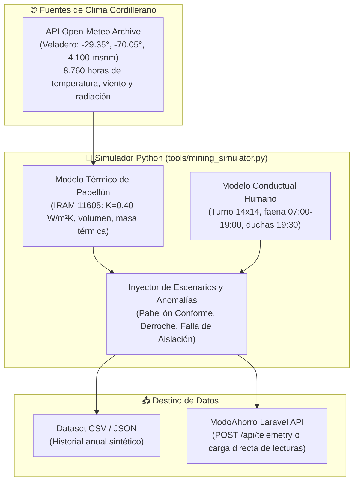

# 🧪 Especificación y Guía del Simulador en Python: Emulador de Gemelo Digital Minero
## *Generador de Telemetría Sintética y Simulación Ciberfísica para Campamentos de Alta Montaña*

---

### 1. Propósito y Fundamento

El objetivo de este script (`tools/mining_simulator.py`) es actuar como un **Emulador Ciberfísico de Campamento Minero (Hardware-in-the-Loop)**. 

Permite:
1. **Validar y afinar el Gemelo Digital** de ModoAhorro sin depender de burocracia, permisos de mina ni acuerdos confidenciales de datos con operadoras.
2. **Generar telemetría sintética hiperrealista** minuto a minuto o por hora, basada en física termodinámica real y series meteorológicas históricas de la cordillera.
3. **Proveer un entorno de pruebas controlado** para detectar desvíos, inyectar anomalías de comportamiento humano y ensayar el comportamiento del sistema ante temporales extremos.
4. **Alimentar demostraciones en vivo aceleradas** para el video pitch o presentaciones ante inversores y jurados.

---

### 2. Arquitectura del Simulador



---

### 3. Modelado Matemático y Físico

El simulador implementa ecuaciones de primeros principios para evitar aproximaciones arbitrarias:

#### A. Balance Térmico del Módulo Habitacional (Ecuación Diferencial Discreta)
Para cada intervalo de tiempo $\Delta t$ (ej. 1 hora o 15 minutos):

$$\Delta T_{\text{interior}} = \frac{Q_{\text{calefacción}} + Q_{\text{solar}} + Q_{\text{ocupantes}} - Q_{\text{pérdidas}}}{C_{\text{térmica}}}$$

Donde:
* $Q_{\text{pérdidas}} = K \cdot A \cdot (T_{\text{interior}} - T_{\text{exterior}}) \cdot (1 + \alpha \cdot V_{\text{viento}})$
  * $K$: Transmitancia térmica del panel sándwich de poliuretano expandido ($0.40 \text{ W/m}^2\text{K}$).
  * $A$: Superficie exterior expuesta del pabellón prefabricado ($\approx 320 \text{ m}^2$).
  * $V_{\text{viento}}$: Velocidad del viento en km/h provista por Open-Meteo.
  * $\alpha$: Coeficiente convectivo por viento blanco andino ($\approx 0.015$).
* $Q_{\text{calefacción}}$: Potencia eléctrica activa entregada por los convectores ($0 \text{ a } 30 \text{ kW}$).
* $Q_{\text{solar}}$: Ganancia solar pasiva a través de ventanas según la irradiancia directa (`direct_normal_irradiance`).
* $C_{\text{térmica}}$: Capacidad calorífica del aire interior y la estructura del pabellón ($\text{kJ/}^\circ\text{C}$).

#### B. Modelo de Ocupación y Comportamiento Humano
* **06:00 – 07:00:** Despertar y preparación. Termotanque al 70%.
* **07:00 – 19:00 (Jornada de Faena - Pabellón Vacío):**
  * *Pabellón Responsable (Modo ECO):* Convectores en standby/mantenimiento (+5 °C a +10 °C para evitar congelamiento). Demanda: $\approx 5\text{ kW}$.
  * *Pabellón en Derroche (Alerta):* Convectores encendidos al 100% con termostato en 28 °C en habitaciones vacías. Demanda: $\approx 25\text{ a } 30\text{ kW}$.
* **19:00 – 21:00 (Retorno de Turno):** Duchas masivas de 40 operarios. Pico de consumo en termotanques acumuladores (potencia: $35\text{ kW}$ sostenida).
* **21:00 – 06:00 (Descanso Nocturno):** Calefacción a 18-20 °C con puertas cerradas. Demanda moderada.

#### C. Equivalencia Económica y Emisiones
* **Litros de Diésel:** $\text{Litros} = \text{kWh} \cdot 0.28 \text{ L/kWh}$.
* **Costo Logístico en Cordillera:** $\text{Costo USD} = \text{Litros} \cdot 1.35 \text{ USD/L}$.
* **Huella de Carbono:** $\text{CO}_2\text{ (kg)} = \text{kWh} \cdot 0.27 \text{ kg CO}_2/\text{kWh}$.

---

### 4. Modos de Ejecución Diseñados

El script contempla una interfaz de línea de comandos (CLI) con dos modalidades principales:

#### Modo 1: Simulación Anual Batch (`--mode=annual`)
* **Qué hace:**
  1. Realiza una única llamada HTTP a Open-Meteo Archive API para el año especificado (ej. 2025) en las coordenadas de Veladero (-29.35, -70.05).
  2. Descarga el JSON con las 8.760 horas de temperatura, radiación y viento.
  3. Ejecuta el bucle de simulación para los 4 pabellones arquetípicos (Conforme, Alerta de Hábito, Falla de Aislación y Falla de Termotanque).
  4. Genera un archivo `veladero_annual_simulation_2025.json` y `.csv` listo para alimentar dashboards históricos o entrenar modelos de detección de anomalías.
* **Tiempo de ejecución estimado:** $\approx 3$ segundos.
* **Comando:**
  ```bash
  python tools/mining_simulator.py --mode=annual --year=2025 --output=veladero_sim.json
  ```

#### Modo 2: Demostración en Tiempo Acelerado (`--mode=live`)
* **Qué hace:**
  1. Simula un ciclo de 24 horas o un turno de faena de 14 días acelerado.
  2. Emite en consola y envía vía HTTP a ModoAhorro una lectura cada segundo de reloj (donde 1 segundo = 1 hora de campamento).
  3. Muestra en pantalla el reloj del campamento, la temperatura exterior descendiendo bajo cero y el momento exacto en que se inyecta el derroche.
* **Tiempo de ejecución:** 24 a 30 segundos de demostración visual continua.
* **Comando:**
  ```bash
  python tools/mining_simulator.py --mode=live --speed=10x --target=http://modoahorro.test/api/telemetry
  ```

---

### 5. Estructura y Dependencias del Script

#### Requisitos Técnicos
* Python 3.10+
* Librerías estándar y ligeras:
  ```bash
  pip install requests
  ```
  *(No requiere librerías pesadas como Pandas o TensorFlow; se resuelve con estructuras nativas de Python y matemáticas puras para máxima portabilidad).*

#### Estructura del Archivo `tools/mining_simulator.py` (Propuesta)
```python
# 1. Constantes Físicas y Geográficas
VELADERO_COORDS = {"latitude": -29.35, "longitude": -70.05, "elevation": 4100}
DIESEL_FACTOR_L_PER_KWH = 0.28
DIESEL_USD_PER_L = 1.35
MODULE_K_COEFF = 0.40  # W/m2K
MODULE_AREA_M2 = 320.0

# 2. Funciones de Consulta a Open-Meteo
def fetch_andean_weather(year: int): ...

# 3. Modelos de Pabellón
class PavillionModel:
    def __init__(self, name: str, behavior_profile: str): ...
    def step_hour(self, weather_data: dict, hour_of_day: int): ...

# 4. Orquestador de Escenarios
def run_annual_batch(year: int, output_file: str): ...
def run_live_stream(speed: int, endpoint: str): ...
```

---

### 6. Integración con ModoAhorro (Laravel + Inertia)

El simulador puede interactuar con ModoAhorro de tres formas:

1. **Vía Base de Datos / Seeder:** El script exporta un archivo JSON con las lecturas generadas, y un comando de Laravel (`php artisan mining:import-simulation veladero_sim.json`) las persiste en la tabla `invoices` como lecturas de tablero seccional.
2. **Vía Endpoint REST / Webhook:** El script hace `POST /api/v1/telemetry/readings` enviando el payload:
   ```json
   {
     "camp_id": 1,
     "pavillion_code": "PAB-A01",
     "timestamp": "2025-07-15T08:00:00Z",
     "active_power_kw": 28.5,
     "kwh_delta": 28.5,
     "ambient_temp_c": -18.2,
     "indoor_temp_c": 21.0,
     "is_shift_hours": true
   }
   ```
3. **Vía Consola Standalone:** Únicamente para análisis estadístico, gráficos en Jupyter Notebook o auditoría técnica offline.

---

### 7. Valor Estratégico para el Proyecto

* **Sustento del Gemelo Digital:** Transforma la sección 7.4 del Informe de Postulación en una propuesta tangible con código de ingeniería verificado.
* **Independencia Operativa:** Permite responder con seguridad ante el jurado: *"El gemelo digital ya cuenta con un entorno de simulación física validado contra series climáticas reales de Veladero."*
* **Cero Riesgo de Seguridad:** Mantiene la premisa de no intrusión en redes SCADA de planta, demostrando que la innovación en habitabilidad puede desarrollarse desde San Juan con rigor científico.
