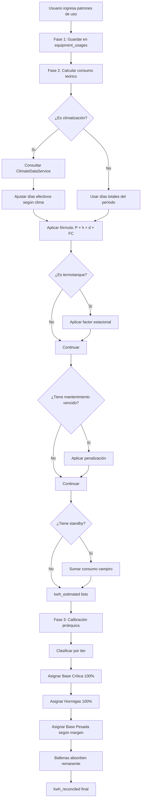

# Auditoría de Base de Datos y Lógica de Cálculo

## 1. Introducción
**Objetivo**: Identificar inconsistencias, cuellos de botella y errores en el motor de cálculo y la estructura de datos del sistema "Modo Ahorro".

## 2. Inventario de Componentes Detectados

### a) Servicios de Cálculo
El motor de cálculo parece estar distribuido en varios servicios:
- **SolarWaterHeaterService**: Calcula viabilidad de termotanques solares. Depende de `ClimateDataService` y `SolarWaterService`.
- **GridOptimizerService**: Calcula ahorros por desplazamiento de cargas. Depende de `TariffScheme`.
- **ConsumptionAnalysisService**: (Pendiente de revisión) Probablemente centraliza el análisis de histórico de facturas.
- **ConsumptionCalibrator**: (Pendiente de revisión) Ajuste de consumos.

### b) Estructura de Base de Datos (Clave para cálculos)
Tablas principales identificadas en migraciones:
- `invoices`: Datos históricos de facturación.
- `equipment_usages`: Perfiles de uso de equipos.
- `tariff_schemes`: Esquemas tarifarios para costos de energía.
- `climate_data`: Datos climáticos para cálculos térmicos/solares.
- `efficiency_benchmarks`: Comparativas de eficiencia.

## 3. Puntos de Auditoría Prouestos

### A. Validación de Datos (Base de Datos)
1.  **Integridad de `invoices`**: Verificar duplicados, saltos en fechas, y consistencia de `total_energy_consumed_kwh` vs importes.
2.  **Integridad de `equipment_usages`**: Verificar que `daily_kwh` y `kwh_reconciled` sean consistentes.
3.  **Tarifas**: Verificar que `TariffScheme` tenga bandas horarias correctamente definidas y sin superposiciones inválidas.

### B. Revisión de Lógica (Código)
1.  **Manejo de Nulos**: Revisar cómo los servicios manejan datos faltantes (ej. `GridOptimizerService` tiene un fallback `daily_kwh * 30` si `kwh_reconciled` es nulo).
2.  **Hardcoded Values**: Detectar valores fijos ocultos (ej. `$averageTariff = 150` en `SolarWaterHeaterService`).
3.  **Precisión**: Verificar fórmulas de ahorro y proyecciones.

## 4. Hallazgos de la Auditoría

### A. Arquitectura del Motor de Cálculo

El sistema implementa un **Motor Integral de Calibración en 3 Fases**:

#### **Fase 1: Entrada de Usuario** (`UsageAdjustmentController`)
- El usuario define patrones de uso por equipo:
  - Frecuencia: diario, semanal, quincenal, mensual, puntual
  - Días de la semana (para diario/semanal)
  - Horas promedio de uso diario
  - Cantidad de usos (para frecuencias puntuales)
  - Duración promedio por uso

#### **Fase 2: Cálculo Teórico** (`ConsumptionAnalysisService`)
Fórmula base: `Energía (kWh) = P × h × d × FC`

Donde:
- **P** = Potencia nominal (kW) - de la etiqueta del equipo
- **h** = Horas de uso promedio diario
- **d** = Días efectivos en el período
- **FC** = Factor de carga real (`load_factor`)

**Ajustes aplicados:**
1. **Ajuste Climático para Climatización** (líneas 124-194):
   - Aires acondicionados: Solo cuentan días con temp ≥28°C
   - Calefacción: Solo cuentan días con temp <15°C
   - Datos obtenidos de Open-Meteo API (históricos gratuitos)

2. **Ajuste Climático para Termotanques** (líneas 210-244):
   - Invierno (temp <15°C): Factor x1.25 (agua más fría)
   - Verano (temp >25°C): Factor x0.85 (agua más tibia)

3. **Ajuste por Mantenimiento** (líneas 78-79, 107-108):
   - Penalización si hay tareas de mantenimiento vencidas
   - Implementado en `MaintenanceService`

4. **Consumo Vampiro/Standby** (líneas 82-95):
   - Calculado para horas que el equipo NO está en uso activo
   - Usa `default_standby_power_w` del tipo de equipo

#### **Fase 3: Calibración Jerárquica** (`ConsumptionCalibrator`)
Distribuye el consumo total de la factura según **prioridades**:

```
1. Base Crítica (Heladeras, Routers, Alarmas)
   → Se asigna el 100% de su consumo estimado SIEMPRE
   
2. Hormigas (Iluminación, Cargadores)
   → Se asigna el 100% de su consumo estimado
   
3. Base Pesada (Termotanques, Bombas)
   → Se asigna lo estimado si hay margen
   
4. Ballenas (Aires, Estufas, PC Gamer, TV)
   → ABSORBEN LA VARIABILIDAD
   → Ajuste proporcional con el remanente
```

**Lógica de distribución** (líneas 39-93):
- Si `remaining >= required`: Asignación completa
- Si `remaining < required`: Asignación proporcional
- Si sobra energía sin ballenas: Redistribución proporcional

### B. Problemas Identificados

#### 🔴 **CRÍTICO 1: Clasificación por String Matching**
**Ubicación:** `ConsumptionCalibrator.php` líneas 96-119 y `UsageAdjustmentController.php` líneas 96-123

**Problema:**
```php
if (str_contains($combined, 'heladera') || str_contains($combined, 'freezer') || ...)
```

- La categorización depende de **palabras clave en el nombre** del equipo
- **Frágil**: Un equipo llamado "Heladera Samsung" se clasifica correctamente, pero "Refrigerador Samsung" cae en "otros"
- **Duplicación de código**: La misma lógica existe en 2 lugares (violación DRY)
- **No escalable**: Agregar nuevas categorías requiere modificar código

**Impacto:**
- Equipos mal clasificados pueden absorber variabilidad cuando deberían ser intocables
- Inconsistencias entre lo que muestra la UI y lo que calcula el calibrador

#### 🔴 **CRÍTICO 2: Falta de Validación de Coherencia**
**Problema:** No hay validación que verifique que la suma de consumos estimados sea **razonable** antes de calibrar.

**Escenarios problemáticos:**
1. Usuario declara que un foco LED de 4W funciona 24h/día durante 30 días
   - Consumo estimado: 2.88 kWh/mes ✅ (razonable)
   
2. Usuario declara que un aire de 2000W funciona 24h/día durante 30 días
   - Consumo estimado: 1440 kWh/mes ❌ (probablemente error)
   - Si la factura dice 300 kWh, el calibrador **forzará** el aire a 1440 kWh y dejará todo lo demás en 0

**Falta:**
- Validación de límites máximos por categoría
- Alertas cuando un equipo "Hormiga" consume más que una "Ballena"
- Detección de outliers antes de calibrar

#### 🟠 **ALTO 3: Dependencia Absoluta de Datos Climáticos**
**Ubicación:** `ConsumptionAnalysisService.php` líneas 124-194

**Problema:**
```php
if ($category !== 'Climatización') {
    return $totalDays; // Sin ajuste
}
// Para climatización, REQUIERE datos climáticos
$effectiveDays = $stats['hot_days_count'] ?? 0;
return max(0, $effectiveDays);
```

**Escenarios problemáticos:**
1. Localidad sin coordenadas → Aire acondicionado usa `$totalDays` (sin ajuste)
2. API de Open-Meteo caída → Fallback a `$totalDays`
3. Período futuro (no hay históricos) → Sin datos

**Impacto:**
- Inconsistencia: Mismo equipo, mismo período, diferentes resultados según disponibilidad de API
- Si la API falla, los aires pueden sobre-estimarse significativamente

#### 🟠 **ALTO 4: Consumo Standby Siempre Activo**
**Ubicación:** `ConsumptionAnalysisService.php` líneas 82-95

**Problema:**
```php
if ($usage->equipment->is_standby) {
    $standbyHoursPerDay = max(0, 24 - $hoursPerDay);
    $standbyConsumption = $standbyPowerKw * $standbyHoursPerDay * $daysInPeriod;
    $consumption += $standbyConsumption;
}
```

**Escenario problemático:**
- Un TV que el usuario dice usar 2h/día
- Standby: 5W
- Período: 30 días
- **Consumo standby = 0.005 kW × 22h × 30 = 3.3 kWh**
- Pero si el usuario desenchufa el TV cuando no lo usa, este cálculo es **incorrecto**

**Falta:**
- Opción para que el usuario indique si desenchufa el equipo
- Diferenciación entre "apagado pero enchufado" vs "desenchufado"

#### 🟡 **MEDIO 5: Hardcoded Thresholds**
**Ubicación:** Múltiples archivos

**Ejemplos:**
```php
// ConsumptionAnalysisService.php línea 158
if (str_contains($equipmentName, 'aire') || ...) {
    $effectiveDays = $stats['hot_days_count'] ?? 0; // Umbral: 28°C (hardcoded en ClimateDataService)
}

// ConsumptionAnalysisService.php línea 229
if ($avgTemp < 15) { // Hardcoded
    return 1.25;
}

// SolarWaterHeaterService.php línea 58
$averageTariff = 150; // Default fallback hardcoded
```

**Problema:**
- Umbrales no configurables por región
- 28°C puede ser razonable para Buenos Aires, pero no para Ushuaia
- No hay forma de ajustar sin modificar código

#### 🟡 **MEDIO 6: Falta de Logging Estructurado**
**Problema:** Los logs existen pero son inconsistentes:
```php
\Log::info("🌡️ AIRE: {$usage->equipment->name} - Días: {$totalDays} → {$effectiveDays}");
```

**Falta:**
- Log de la **decisión de calibración** (por qué se ajustó X equipo)
- Trazabilidad: ¿Qué factores afectaron el cálculo final?
- Historial de ajustes para debugging

#### 🟢 **BAJO 7: Eficiencia de Consultas**
**Ubicación:** `UsageAdjustmentController.php` líneas 61-74

**Problema potencial:**
```php
$rooms = $entity->rooms()->with(['equipment' => function($q) use ($invoice) {
    // Consulta compleja con múltiples condiciones
}])->get();
```

- Para entidades con muchas habitaciones y equipos, puede ser lento
- No hay paginación ni límites

### C. Fortalezas del Sistema

✅ **Arquitectura bien pensada**: Separación clara entre entrada, cálculo y calibración
✅ **Integración climática**: Uso de API gratuita (Open-Meteo) con caché en BD
✅ **Jerarquía de prioridades**: Concepto de Base Crítica → Hormigas → Pesada → Ballenas es sólido
✅ **Ajustes contextuales**: Termotanques con factor estacional es un buen detalle
✅ **Consumo vampiro**: Consideración del standby es importante

### D. Recomendaciones Prioritarias

#### 🎯 **Prioridad 1: Refactorizar Clasificación de Equipos**
**Acción:**
1. Agregar campo `tier` a la tabla `equipment_types` (enum: 'base_critica', 'base_pesada', 'hormigas', 'ballenas', 'otros')
2. Migrar lógica de string matching a configuración de base de datos
3. Crear interfaz para que el usuario pueda **reclasificar** equipos manualmente

**Beneficio:**
- Elimina fragilidad
- Permite personalización por usuario
- Centraliza la lógica

#### 🎯 **Prioridad 2: Implementar Validación Pre-Calibración**
**Acción:**
1. Calcular límites teóricos por categoría:
   ```
   Hormigas: Max 5% del total de la factura
   Base Crítica: Max 30% del total
   Base Pesada: Max 40% del total
   Ballenas: Resto
   ```
2. Alertar al usuario si los valores declarados exceden límites
3. Sugerir ajustes automáticos

**Beneficio:**
- Previene errores de entrada
- Mejora la precisión del calibrador

#### 🎯 **Prioridad 3: Hacer Configurables los Umbrales Climáticos**
**Acción:**
1. Agregar tabla `climate_thresholds` con campos:
   - `locality_id` (o `province_id` para regionalización)
   - `hot_threshold` (default: 28°C)
   - `cold_threshold` (default: 15°C)
   - `water_heater_winter_factor` (default: 1.25)
   - `water_heater_summer_factor` (default: 0.85)

**Beneficio:**
- Adaptabilidad regional
- Mejora precisión en diferentes climas

#### 🎯 **Prioridad 4: Mejorar Manejo de Standby**
**Acción:**
1. Agregar campo `is_unplugged_when_off` a `equipment_usages`
2. Solo calcular standby si `is_unplugged_when_off = false`

**Beneficio:**
- Mayor precisión para usuarios conscientes del consumo vampiro

#### 🎯 **Prioridad 5: Implementar Audit Trail**
**Acción:**
1. Crear tabla `calibration_logs`:
   ```sql
   - invoice_id
   - equipment_id
   - kwh_estimated
   - kwh_reconciled
   - tier
   - calibration_note
   - climate_factor_applied
   - maintenance_penalty_applied
   - timestamp
   ```
2. Registrar cada decisión del calibrador

**Beneficio:**
- Debugging facilitado
- Transparencia para el usuario
- Análisis de patrones

### E. Diagrama de Flujo del Motor Actual



## 5. Conclusión

El motor de cálculo tiene una **arquitectura sólida** con conceptos bien fundamentados (jerarquía de prioridades, ajuste climático, consumo vampiro). Sin embargo, presenta **fragilidades críticas** en:

1. **Clasificación de equipos** (string matching frágil)
2. **Validación de entrada** (permite valores incoherentes)
3. **Configurabilidad** (umbrales hardcoded)

Las recomendaciones propuestas son **implementables** y mejorarían significativamente la **precisión** y **robustez** del sistema sin requerir una reescritura completa.

**Próximos pasos sugeridos:**
1. Implementar Prioridad 1 (refactorizar clasificación)
2. Agregar validaciones pre-calibración (Prioridad 2)
3. Crear suite de tests unitarios para el calibrador
4. Documentar casos de uso y límites del sistema

