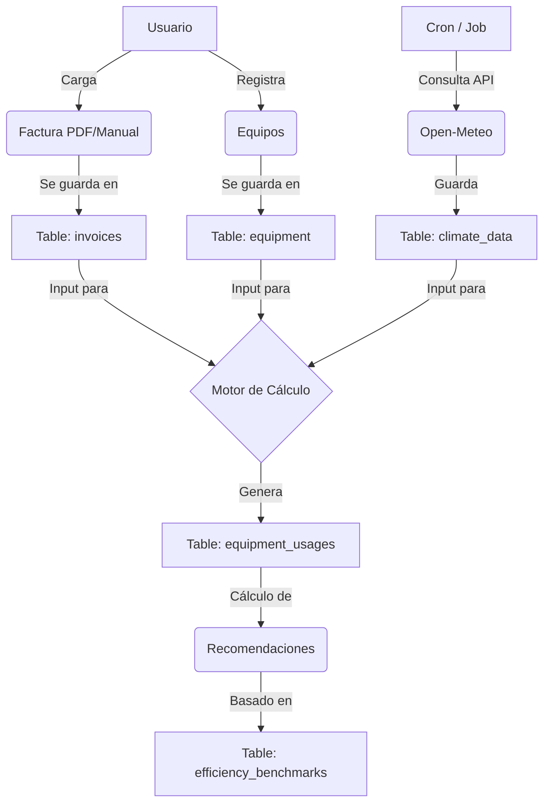

# Base de Datos — ModoAhorro

> **Motor:** SQLite (desarrollo) / MySQL (producción)  
> **Framework:** Laravel (Eloquent ORM)  
> **Última actualización del esquema:** febrero 2026  
> **Migraciones totales:** 53  

---

## Índice de Tablas

| Tabla | Descripción |
|---|---|
| [users](#1-users) | Usuarios del sistema |
| [password_reset_tokens](#2-password_reset_tokens) | Tokens de restablecimiento de contraseña |
| [sessions](#3-sessions) | Sesiones activas |
| [plans](#4-plans) | Planes de suscripción |
| [entities](#5-entities) | Entidades monitoreadas (hogares, oficinas, comercios) |
| [entity_user](#6-entity_user) | Relación usuario ↔ entidad ↔ plan |
| [rooms](#7-rooms) | Habitaciones/ambientes dentro de una entidad |
| [provinces](#8-provinces) | Provincias |
| [localities](#9-localities) | Localidades |
| [proveedores](#10-proveedores) | Proveedores de servicio eléctrico |
| [contracts](#11-contracts) | Contratos de suministro eléctrico |
| [invoices](#12-invoices) | Facturas de electricidad |
| [usage_adjustments](#13-usage_adjustments) | Registro de ajuste de consumos por factura |
| [equipment_categories](#14-equipment_categories) | Categorías de equipos (Climatización, Iluminación, etc.) |
| [equipment_types](#15-equipment_types) | Tipos de equipos con parámetros técnicos |
| [equipment](#16-equipment) | Equipos registrados en una habitación |
| [equipment_usages](#17-equipment_usages) | Consumo estimado de cada equipo por factura |
| [equipment_history](#18-equipment_history) | Historial de altas, bajas y reemplazos de equipos |
| [climate_data](#19-climate_data) | Datos climáticos diarios por coordenada geográfica |
| [tariff_schemes](#20-tariff_schemes) | Esquemas tarifarios |
| [tariff_bands](#21-tariff_bands) | Franjas horarias de tarifas (Pico, Valle, Resto) |
| [efficiency_benchmarks](#22-efficiency_benchmarks) | Benchmarks de eficiencia por tipo de equipo |
| [maintenance_tasks](#23-maintenance_tasks) | Tareas de mantenimiento por tipo de equipo |
| [maintenance_logs](#24-maintenance_logs) | Registros de mantenimiento realizados |

> **Tablas eliminadas en migración 2026-02-11:** `devices`, `device_usages`, `utility_companies` (obsoletas, reemplazadas por la arquitectura de `equipment`).

---

## Detalle de Tablas

### 1. `users`
Usuarios del sistema. Admite super-administradores.

| Columna | Tipo | Nulable | Default | Descripción |
|---|---|---|---|---|
| `id` | bigint PK | No | auto | Identificador único |
| `name` | varchar | No | — | Nombre del usuario |
| `email` | varchar (unique) | No | — | Correo electrónico |
| `email_verified_at` | timestamp | Sí | null | Fecha de verificación |
| `password` | varchar | No | — | Hash de contraseña |
| `is_super_admin` | boolean | No | false | Indica si es superadministrador |
| `remember_token` | varchar | Sí | null | Token de sesión persistente |
| `created_at` / `updated_at` | timestamp | Sí | null | Marcas de tiempo |

---

### 2. `password_reset_tokens`
Tokens temporales para recuperación de contraseña.

| Columna | Tipo | Nulable | Default | Descripción |
|---|---|---|---|---|
| `email` | varchar (PK) | No | — | Correo al que pertenece el token |
| `token` | varchar | No | — | Token de recuperación |
| `created_at` | timestamp | Sí | null | Fecha de creación |

---

### 3. `sessions`
Sesiones de usuario activas.

| Columna | Tipo | Nulable | Default | Descripción |
|---|---|---|---|---|
| `id` | varchar (PK) | No | — | ID de sesión |
| `user_id` | bigint (FK→users, idx) | Sí | null | Usuario propietario |
| `ip_address` | varchar(45) | Sí | null | IP de origen |
| `user_agent` | text | Sí | null | Agente de usuario |
| `payload` | longtext | No | — | Datos de la sesión |
| `last_activity` | integer (idx) | No | — | Timestamp Unix de última actividad |

---

### 4. `plans`
Planes de suscripción disponibles en el sistema.

| Columna | Tipo | Nulable | Default | Descripción |
|---|---|---|---|---|
| `id` | bigint PK | No | auto | Identificador único |
| `name` | varchar | No | — | Nombre del plan (Gratuito, Premium, etc.) |
| `features` | text | Sí | null | Lista de características (JSON o texto) |
| `price` | decimal(8,2) | No | 0 | Precio del plan |
| `max_entities` | unsigned int | No | 1 | Límite de entidades por plan |
| `allowed_entity_types` | json | No | `["hogar"]` | Tipos de entidad permitidos por este plan |
| `created_at` / `updated_at` | timestamp | Sí | null | Marcas de tiempo |

---

### 5. `entities`
Representa un hogar, oficina o comercio que se analiza energéticamente.

| Columna | Tipo | Nulable | Default | Descripción |
|---|---|---|---|---|
| `id` | bigint PK | No | auto | Identificador único |
| `name` | varchar | No | — | Nombre del hogar/entidad |
| `type` | varchar | No | `'hogar'` | Tipo: `hogar`, `oficina`, `comercio` |
| `address_street` | varchar | Sí | null | Calle y número |
| `address_postal_code` | varchar | Sí | null | Código postal |
| `locality_id` | unsigned int | Sí | null | Localidad (FK→localities) |
| `description` | text | Sí | null | Descripción libre |
| `square_meters` | float | Sí | null | Superficie en m² |
| `people_count` | unsigned int | Sí | null | Cantidad de personas que habitan |
| `thermal_profile` | json | Sí | null | Perfil térmico de la entidad |
| `opens_at` | time | Sí | null | Hora de apertura (oficinas/comercios) |
| `closes_at` | time | Sí | null | Hora de cierre (oficinas/comercios) |
| `operating_days` | json | Sí | null | Días hábiles de operación |
| `created_at` / `updated_at` | timestamp | Sí | null | Marcas de tiempo |

---

### 6. `entity_user`
Tabla pivote que asocia un usuario con una entidad bajo un plan determinado.

| Columna | Tipo | Nulable | Default | Descripción |
|---|---|---|---|---|
| `id` | bigint PK | No | auto | Identificador único |
| `user_id` | bigint FK→users | No | — | Usuario |
| `entity_id` | bigint FK→entities | No | — | Entidad |
| `plan_id` | bigint FK→plans | No | — | Plan aplicado |
| `subscribed_at` | timestamp | Sí | null | Fecha de suscripción |
| `expires_at` | timestamp | Sí | null | Fecha de expiración |
| `created_at` / `updated_at` | timestamp | Sí | null | Marcas de tiempo |

---

### 7. `rooms`
Habitaciones o ambientes que pertenecen a una entidad.

| Columna | Tipo | Nulable | Default | Descripción |
|---|---|---|---|---|
| `id` | bigint PK | No | auto | Identificador único |
| `entity_id` | bigint FK→entities | No | — | Entidad a la que pertenece |
| `name` | varchar | No | — | Nombre (Cocina, Baño, Dormitorio, etc.) |
| `square_meters` | integer | No | 0 | Superficie en m² |
| `description` | text | Sí | null | Descripción libre |
| `created_at` / `updated_at` | timestamp | Sí | null | Marcas de tiempo |

---

### 8. `provinces`
Catálogo de provincias argentinas.

| Columna | Tipo | Nulable | Default | Descripción |
|---|---|---|---|---|
| `id` | bigint PK | No | auto | Identificador único |
| `name` | varchar (unique) | No | — | Nombre de la provincia |
| `created_at` / `updated_at` | timestamp | Sí | null | Marcas de tiempo |

---

### 9. `localities`
Catálogo de localidades, con coordenadas geográficas para obtener datos climáticos.

| Columna | Tipo | Nulable | Default | Descripción |
|---|---|---|---|---|
| `id` | bigint PK | No | auto | Identificador único |
| `province_id` | bigint FK→provinces | No | — | Provincia a la que pertenece |
| `name` | varchar | No | — | Nombre de la localidad |
| `postal_code` | varchar | Sí | null | Código postal |
| `latitude` | decimal(10,8) | Sí | null | Latitud geográfica |
| `longitude` | decimal(11,8) | Sí | null | Longitud geográfica |
| `created_at` / `updated_at` | timestamp | Sí | null | Marcas de tiempo |

---

### 10. `proveedores`
Proveedores de electricidad o distribuidoras.

| Columna | Tipo | Nulable | Default | Descripción |
|---|---|---|---|---|
| `id` | bigint PK | No | auto | Identificador único |
| `name` | varchar | No | — | Nombre del proveedor |
| `cuit` | varchar | Sí | null | CUIT de la empresa |
| `address` | varchar | Sí | null | Dirección |
| `phone` | varchar | Sí | null | Teléfono |
| `email` | varchar | Sí | null | Correo electrónico |
| `province_id` | bigint FK→provinces | No | — | Provincia de operación |
| `created_at` / `updated_at` | timestamp | Sí | null | Marcas de tiempo |

---

### 11. `contracts`
Contrato de suministro eléctrico entre una entidad y un proveedor.

| Columna | Tipo | Nulable | Default | Descripción |
|---|---|---|---|---|
| `id` | bigint PK | No | auto | Identificador único |
| `contract_number` | varchar (unique) | No | — | Número de contrato |
| `entity_id` | bigint FK→entities | No | — | Entidad contratante |
| `proveedor_id` | bigint FK→proveedores | No | — | Proveedor de servicio |
| `serial_number` | varchar | Sí | null | Número de serie del medidor |
| `meter_number` | varchar | No | — | Número de medidor |
| `client_number` | varchar | No | — | Número de cliente |
| `supply_number` | varchar | Sí | null | Número de suministro |
| `contract_identifier` | varchar | Sí | null | Identificador adicional del contrato |
| `rate_name` | varchar | Sí | null | Nombre de la tarifa |
| `tariff_type` | varchar | No | — | Tipo de tarifa |
| `is_three_phase` | boolean | No | false | Indica si es trifásico |
| `contracted_power_kw_p1` | decimal(8,3) | Sí | null | Potencia contratada Período 1 (kW) |
| `contracted_power_kw_p2` | decimal(8,3) | Sí | null | Potencia contratada Período 2 (kW) |
| `contracted_power_kw_p3` | decimal(8,3) | Sí | null | Potencia contratada Período 3 (kW) |
| `start_date` | date | No | — | Fecha de inicio del contrato |
| `end_date` | date | Sí | null | Fecha de finalización |
| `is_active` | boolean | No | true | Estado del contrato |
| `created_at` / `updated_at` | timestamp | Sí | null | Marcas de tiempo |

---

### 12. `invoices`
Facturas de electricidad. Cada factura pertenece a un contrato y puede tener consumos detallados por período tarifario (P1/P2/P3) y datos de autoconsumo solar.

| Columna | Tipo | Nulable | Default | Descripción |
|---|---|---|---|---|
| `id` | bigint PK | No | auto | Identificador único |
| `contract_id` | bigint FK→contracts | No | — | Contrato al que pertenece |
| `invoice_number` | varchar | Sí | null | Número de factura |
| `issue_date` | date | No | — | Fecha de emisión |
| `invoice_date` | date | Sí | null | Fecha de la factura |
| `start_date` | date | No | — | Inicio del período facturado |
| `end_date` | date | No | — | Fin del período facturado |
| `energy_consumed_p1_kwh` | decimal(10,3) | Sí | null | Consumo P1 en kWh |
| `energy_consumed_p2_kwh` | decimal(10,3) | Sí | null | Consumo P2 en kWh |
| `energy_consumed_p3_kwh` | decimal(10,3) | Sí | null | Consumo P3 en kWh |
| `total_energy_consumed_kwh` | decimal(10,3) | Sí | null | Consumo total en kWh |
| `cost_for_energy` | decimal(10,2) | Sí | null | Costo por energía consumida |
| `cost_for_power` | decimal(10,2) | Sí | null | Costo por potencia contratada |
| `taxes` | decimal(10,2) | Sí | null | Impuestos |
| `other_charges` | decimal(10,2) | Sí | null | Otros cargos |
| `total_amount` | decimal(10,2) | No | — | Total de la factura |
| `is_representative` | boolean | No | true | Si es representativa (no anómala) |
| `anomaly_reason` | varchar | Sí | null | Motivo de anomalía |
| `status` | varchar | No | `'paid'` | Estado: `paid`, `pending` |
| `usage_locked` | boolean | No | false | Bloquea edición de uso de equipos |
| `total_energy_injected_kwh` | decimal(10,3) | Sí | null | Energía inyectada a la red (solar) |
| `surplus_compensation_amount` | decimal(10,2) | Sí | null | Compensación por excedente solar |
| `file_path` | varchar | Sí | null | Ruta al archivo PDF de la factura |
| `source` | varchar | No | `'manual'` | Origen: `manual`, `ocr`, etc. |
| `co2_footprint_kg` | decimal(10,3) | Sí | null | Huella de carbono estimada (kg CO₂) |
| `created_at` / `updated_at` | timestamp | Sí | null | Marcas de tiempo |

---

### 13. `usage_adjustments`
Registro de si una factura ya fue ajustada con el detalle de consumo por equipo.

| Columna | Tipo | Nulable | Default | Descripción |
|---|---|---|---|---|
| `id` | bigint PK | No | auto | Identificador único |
| `invoice_id` | bigint FK→invoices | No | — | Factura ajustada |
| `adjusted` | boolean | No | false | Si fue ajustada |
| `adjusted_at` | timestamp | Sí | null | Fecha del ajuste |
| `notes` | text | Sí | null | Notas del ajuste |
| `created_at` / `updated_at` | timestamp | Sí | null | Marcas de tiempo |

---

### 14. `equipment_categories`
Categorías de agrupación de equipos eléctricos.  
*Ejemplos: Climatización, Iluminación, Electrodomésticos, Entretenimiento.*

| Columna | Tipo | Nulable | Default | Descripción |
|---|---|---|---|---|
| `id` | bigint PK | No | auto | Identificador único |
| `name` | varchar (unique) | No | — | Nombre de la categoría |
| `created_at` / `updated_at` | timestamp | Sí | null | Marcas de tiempo |

---

### 15. `equipment_types`
Tipos de equipos con sus parámetros técnicos por defecto. Sirve como plantilla para registrar equipos concretos.

| Columna | Tipo | Nulable | Default | Descripción |
|---|---|---|---|---|
| `id` | bigint PK | No | auto | Identificador único |
| `category_id` | bigint FK→equipment_categories | No | — | Categoría que agrupa el tipo |
| `name` | varchar (unique) | No | — | Nombre del tipo (e.g. "Aire Acondicionado Split") |
| `process_type` | varchar | Sí | null | Tipo de proceso: Motor, Resistencia, Electrónico, etc. |
| `default_power_watts` | integer | Sí | null | Potencia nominal por defecto (W) |
| `default_standby_power_w` | float | No | 0 | Consumo en modo espera (W) |
| `default_avg_daily_use_hours` | decimal(4,2) | Sí | null | Horas de uso diario por defecto |
| `load_factor` | decimal(3,2) | Sí | 1.0 | Factor de carga (duty cycle) |
| `intensity` | varchar | Sí | null | Intensidad de uso: bajo, medio, alto, excesivo |
| `efficiency` | decimal(3,2) | Sí | 1.0 | Eficiencia del equipo |
| `is_shiftable` | boolean | No | false | Si el uso puede desplazarse en el tiempo |
| `is_climatization` | boolean | No | false | Si es equipo de climatización |
| `created_at` / `updated_at` | timestamp | Sí | null | Marcas de tiempo |

---

### 16. `equipment`
Equipos eléctricos concretos registrados en una habitación.

| Columna | Tipo | Nulable | Default | Descripción |
|---|---|---|---|---|
| `id` | bigint PK | No | auto | Identificador único |
| `name` | varchar | No | — | Nombre o descripción del equipo |
| `room_id` | bigint FK→rooms | No | — | Habitación donde está instalado |
| `category_id` | bigint FK→equipment_categories | No | — | Categoría del equipo |
| `type_id` | bigint FK→equipment_types | Sí | null | Tipo de equipo (plantilla técnica) |
| `nominal_power_w` | integer | Sí | null | Potencia nominal real (W) |
| `is_standby` | boolean | No | false | Si consume en modo standby |
| `avg_daily_use_hours` | decimal(4,2) | Sí | null | Horas de uso diario promedio |
| `usage_frequency` | varchar | Sí | null | Frecuencia de uso (diario, semanal, etc.) |
| `use_days_per_week` | integer | Sí | null | Días de uso por semana |
| `is_active` | boolean | No | true | Si el equipo está activo |
| `is_validated` | boolean | No | false | Si el consumo fue validado manualmente |
| `intensity` | varchar | Sí | null | Override de intensidad de uso |
| `acquisition_year` | integer | Sí | null | Año de compra |
| `energy_label` | varchar | Sí | null | Etiqueta energética (A+++, A, B, C…) |
| `is_inverter` | boolean | No | false | Tecnología Inverter |
| `capacity` | decimal(8,2) | Sí | null | Capacidad del equipo |
| `capacity_unit` | varchar | Sí | null | Unidad de capacidad (frigorías, kg, litros) |
| `installation_date` | date | Sí | null | Fecha de instalación |
| `deactivation_date` | date | Sí | null | Fecha de baja |
| `created_at` / `updated_at` | timestamp | Sí | null | Marcas de tiempo |

---

### 17. `equipment_usages`
Consumo estimado de cada equipo en el período de una factura específica. Es el núcleo del **Motor de Análisis Energético**.

| Columna | Tipo | Nulable | Default | Descripción |
|---|---|---|---|---|
| `id` | bigint PK | No | auto | Identificador único |
| `invoice_id` | bigint FK→invoices | No | — | Factura del período |
| `equipment_id` | bigint FK→equipment | No | — | Equipo evaluado |
| `is_standby` | boolean | No | false | Si este registro es para standby |
| `avg_daily_use_hours` | decimal(4,2) | Sí | null | Horas de uso diario en el período |
| `use_days_in_period` | integer | Sí | null | Días de uso en el período facturado |
| `consumption_kwh` | decimal(10,2) | Sí | null | Consumo estimado en kWh |
| `climate_adjustment_percent` | decimal(5,2) | Sí | null | Ajuste climático aplicado (%) |
| `days_of_week` | json/text | Sí | null | Días de la semana activos |
| `frequency` | varchar | Sí | null | Frecuencia del uso |
| `kwh_reconciled` | decimal(10,4) | Sí | null | kWh reconciliados por el motor (v3) |
| `tank_assignment` | tinyint | Sí | null | Asignación de tanque de energía |
| `audit_logs` | json | Sí | null | Trazabilidad del cálculo del motor |
| `created_at` / `updated_at` | timestamp | Sí | null | Marcas de tiempo |

---

### 18. `equipment_history`
Historial de eventos sobre equipos: altas, bajas, reemplazos y backups.

| Columna | Tipo | Nulable | Default | Descripción |
|---|---|---|---|---|
| `id` | bigint PK | No | auto | Identificador único |
| `equipment_id` | bigint FK→equipment | Sí | null | Equipo principal involucrado |
| `old_equipment_id` | bigint FK→equipment | Sí | null | Equipo antiguo (en reemplazos) |
| `new_equipment_id` | bigint FK→equipment | Sí | null | Equipo nuevo (en reemplazos) |
| `action` | varchar | No | — | Acción: `alta`, `baja`, `reemplazo`, `backup` |
| `reason` | text | Sí | null | Motivo del evento |
| `action_date` | timestamp | Sí | null | Fecha del evento |
| `replacement_date` | timestamp | Sí | null | Fecha de reemplazo efectivo |
| `user_id` | bigint FK→users | Sí | null | Usuario que realizó la acción |
| `invoice_id` | bigint FK→invoices | Sí | null | Factura asociada al evento |
| `created_at` / `updated_at` | timestamp | Sí | null | Marcas de tiempo |

---

### 19. `climate_data`
Datos climáticos diarios por coordenada geográfica. Se obtienen de la API Open-Meteo.

| Columna | Tipo | Nulable | Default | Descripción |
|---|---|---|---|---|
| `id` | bigint PK | No | auto | Identificador único |
| `date` | date (idx) | No | — | Fecha del registro |
| `latitude` | decimal(8,6) | No | — | Latitud geográfica |
| `longitude` | decimal(9,6) | No | — | Longitud geográfica |
| `temp_max` | decimal(4,1) | No | — | Temperatura máxima del día (°C) |
| `temp_min` | decimal(4,1) | No | — | Temperatura mínima del día (°C) |
| `temp_avg` | decimal(4,1) | Sí | null | Temperatura promedio (°C) |
| `cooling_degree_days` | decimal(8,2) | Sí | null | Grados-día de refrigeración |
| `heating_degree_days` | decimal(8,2) | Sí | null | Grados-día de calefacción |
| `precipitation_mm` | decimal(8,2) | Sí | null | Precipitaciones (mm) |
| `wind_speed_kmh` | decimal(8,2) | Sí | null | Velocidad del viento (km/h) |
| `humidity_percent` | integer | Sí | null | Humedad relativa (%) |
| `cloudcover_mean` | integer | Sí | null | Cobertura nubosa media (%) |
| `sunshine_duration` | float | Sí | null | Duración de sol (segundos) |
| `shortwave_radiation_sum` | float | Sí | null | Radiación solar total (MJ/m²) |
| `created_at` / `updated_at` | timestamp | Sí | null | Marcas de tiempo |

> **Restricción única:** `(date, latitude, longitude)` — evita duplicados por fecha y ubicación.

---

### 20. `tariff_schemes`
Esquemas tarifarios de distintos proveedores para cálculos de ahorro por desplazamiento de carga.

| Columna | Tipo | Nulable | Default | Descripción |
|---|---|---|---|---|
| `id` | bigint PK | No | auto | Identificador único |
| `name` | varchar | No | — | Nombre del esquema |
| `provider` | varchar | No | — | Proveedor/empresa distribuidora |
| `created_at` / `updated_at` | timestamp | Sí | null | Marcas de tiempo |

---

### 21. `tariff_bands`
Franjas horarias con precio diferencial dentro de un esquema tarifario.

| Columna | Tipo | Nulable | Default | Descripción |
|---|---|---|---|---|
| `id` | bigint PK | No | auto | Identificador único |
| `tariff_scheme_id` | bigint FK→tariff_schemes | No | — | Esquema al que pertenece |
| `name` | varchar | No | — | Nombre de la franja (Pico, Valle, Resto) |
| `start_time` | time | No | — | Hora de inicio |
| `end_time` | time | No | — | Hora de fin |
| `price_per_kwh` | decimal(10,2) | No | — | Precio por kWh |
| `is_weekend_applicable` | boolean | No | false | Si aplica en fines de semana |
| `created_at` / `updated_at` | timestamp | Sí | null | Marcas de tiempo |

---

### 22. `efficiency_benchmarks`
Benchmarks de eficiencia por tipo de equipo para generar recomendaciones de reemplazo.

| Columna | Tipo | Nulable | Default | Descripción |
|---|---|---|---|---|
| `id` | bigint PK | No | auto | Identificador único |
| `equipment_type_id` | bigint FK→equipment_types | No | — | Tipo de equipo de referencia |
| `efficiency_gain_factor` | decimal(5,2) | No | — | Factor de ganancia (ej. 0.30 = 30% ahorro) |
| `average_market_price` | decimal(10,2) | No | — | Precio promedio de mercado |
| `meli_search_term` | varchar | No | — | Término de búsqueda en Mercado Libre |
| `affiliate_link` | varchar | Sí | null | Link de afiliado generado |
| `created_at` / `updated_at` | timestamp | Sí | null | Marcas de tiempo |

---

### 23. `maintenance_tasks`
Tareas de mantenimiento preventivo definidas por tipo de equipo.

| Columna | Tipo | Nulable | Default | Descripción |
|---|---|---|---|---|
| `id` | bigint PK | No | auto | Identificador único |
| `equipment_type_id` | bigint FK→equipment_types | No | — | Tipo de equipo asociado |
| `title` | varchar | No | — | Título de la tarea |
| `frequency_days` | integer | Sí | null | Días para vencimiento (null = estacional puro) |
| `season_month` | integer | Sí | null | Mes de disparo estacional (1–12) |
| `efficiency_impact` | decimal(5,2) | No | 0.10 | Penalización si no se realiza (ej. 0.10 = 10%) |
| `created_at` / `updated_at` | timestamp | Sí | null | Marcas de tiempo |

---

### 24. `maintenance_logs`
Registros de tareas de mantenimiento realizadas sobre equipos concretos.

| Columna | Tipo | Nulable | Default | Descripción |
|---|---|---|---|---|
| `id` | bigint PK | No | auto | Identificador único |
| `equipment_id` | bigint FK→equipment | No | — | Equipo al que se le realizó el mantenimiento |
| `maintenance_task_id` | bigint FK→maintenance_tasks | No | — | Tarea realizada |
| `completed_at` | timestamp | No | — | Fecha y hora de realización |
| `notes` | text | Sí | null | Notas adicionales |
| `created_at` / `updated_at` | timestamp | Sí | null | Marcas de tiempo |

---

## Diagrama de Relaciones (ERD resumido)

```
users ─────────────────────── entity_user ─── entities ─── rooms ─── equipment
                                   │               │                      │
                                 plans         localities             equipment_types
                                                   │                      │
                                               provinces          equipment_categories
                                                                          │
entities ─── contracts ─── invoices ─── equipment_usages ─── equipment ──┘
                 │               │
           proveedores    usage_adjustments
                          equipment_history
                          climate_data (por lat/lon de locality)
                          tariff_schemes ─── tariff_bands
                          efficiency_benchmarks
                          maintenance_tasks ─── maintenance_logs
```

---

## Convenciones del Esquema

- **Soft Deletes:** La tabla `equipment` (legacy) utilizaba `softDeletes()` aunque fue removido en refactorizaciones posteriores.
- **JSON Columns:** Se usan para datos flexibles: `features` (plans), `thermal_profile`, `operating_days`, `allowed_entity_types`, `audit_logs` (equipment_usages).
- **Unique compuesta:** `climate_data` usa `(date, latitude, longitude)` para prevenir duplicados.
- **Tablas eliminadas:** `devices`, `device_usages` y `utility_companies` existieron en versiones tempranas pero fueron eliminadas en la migración `2026_02_11_225426_drop_unused_tables` al consolidarse la arquitectura de `equipment`.
- **Motor de Análisis (v3):** Los campos `kwh_reconciled`, `tank_assignment` y `audit_logs` en `equipment_usages` son los campos centrales del Motor Energético versión 3, que realiza reconciliación de consumos con la factura real.

---

## Lógica de Negocio y Relaciones Clave

### El Motor de Cálculo (Tanques Virtuales)

El corazón del sistema reside en la relación entre `invoices`, `equipment` y `climate_data`, orquestada en `equipment_usages`. El proceso de "reconciliación" distribuye el consumo total de la factura en tres tanques virtuales (`equipment_usages.tank_assignment`):

1.  **Tanque 1 (Base):** Equipos de consumo constante (Heladeras, Routers). Se calcula: `Potencia × 24h`.
2.  **Tanque 2 (Clima):** Equipos de climatización (Aires, Estufas). Se calcula usando `climate_data` (HDD/CDD) y la eficiencia térmica de `entities`.
3.  **Tanque 3 (Elasticidad):** Equipos de uso variable (Luces, TV). Absorben el remanente de la factura para cuadrar el total.

### Auditoría y Trazabilidad

Cada registro en `equipment_usages` almacena en `audit_logs` (JSON) el detalle de cómo se calculó ese consumo específico. Esto permite reconstruir la lógica del motor para cualquier factura histórica.

Ejemplo de `audit_logs`:
```json
{
  "tank": "Clima",
  "hdd_detected": 150,
  "thermal_efficiency": 0.85,
  "original_estimate": 450.5,
  "final_reconciled": 420.0
}
```

---

## Diccionario de Datos Clave

### `users.is_super_admin`
- `0` (false): Usuario final (Hogar/Comercio).
- `1` (true): Administrador del sistema con acceso global.

### `plans.allowed_entity_types` (JSON)
- `["hogar"]`: Plan residencial.
- `["comercio", "oficina"]`: Plan comercial/profesional.

### `invoices.status`
- `'paid'`: Factura pagada y cerrada.
- `'pending'`: Factura pendiente de pago o validación.
- `'analyzing'`: En proceso de análisis por el motor.

### `equipment.intensity` y `equipment_types.intensity`
- `'bajo'`: Uso esporádico o menor al promedio.
- `'medio'`: Uso estándar de mercado.
- `'alto'`: Uso intensivo.
- `'excesivo'`: Posible anomalía o mal uso.

### `equipment_history.action`
- `'alta'`: Registro inicial del equipo.
- `'baja'`: Retiro o desinstalación.
- `'reemplazo'`: Sustitución por uno más eficiente (genera ROI).
- `'backup'`: Equipo secundario que respalda a otro.

---

## Flujo de Datos Principal


